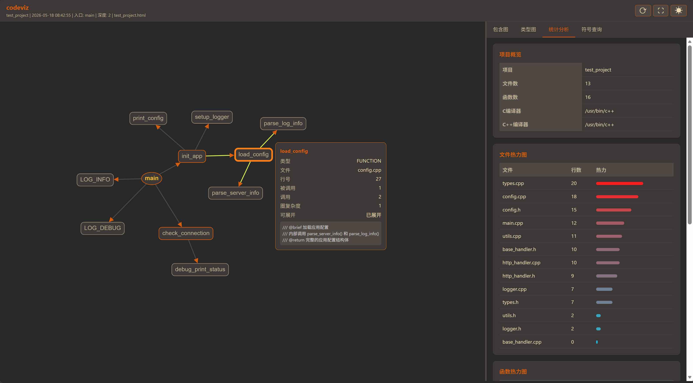

# codeviz - C/C++ 源码可视化分析工具

[](LICENSE)
[](https://en.cppreference.com/w/cpp/17)
[](https://cmake.org/)

codeviz 是一个面向终端用户的 C/C++ 源码静态分析与可视化工具。基于 tree-sitter 语法解析引擎，能够深入分析项目源码，生成交互式 HTML 分析报告，帮助开发者快速理解代码结构和依赖关系。


## 功能特性

### 调用图分析
- 从指定入口函数（默认 `main`）开始展开调用链
- 支持自定义展开深度（1~20 层）
- 自动计算函数扇入/扇出、圈复杂度
- 区分函数定义与函数调用，处理跨文件调用

### 数据结构可视化
- 识别结构体（`struct`）和类（`class`）定义
- 展示类型间的继承关系（`INHERITS`）
- 展示字段包含关系（`CONTAINS`）
- 支持嵌套类型和基类列表提取

### 头文件包含图
- 解析 `#include` 指令，构建文件依赖图
- 自动解析相对路径和系统头文件
- 检测并报告循环包含（基于 Tarjan SCC 算法）

### 统计分析
- 文件代码行数统计
- 函数圈复杂度计算
- 热力图（基于代码行数、扇入、扇出）
- 异常检测（循环依赖等）

### 报告生成
- 自包含离线 HTML 报告（内嵌 Cytoscape.js）
- 深色主题，适配宽屏显示
- 交互式图可视化：拖拽节点、缩放、点击查看详情
- 符号搜索栏快速定位

## 快速开始

### 构建

```bash
# 一键构建（Debug 模式）
./build.sh

# Release 模式
./build.sh --release

# 手动构建
cmake -B build -DCMAKE_BUILD_TYPE=Release
cmake --build build -j$(nproc)
```

### 使用

```bash
# 基本用法：分析当前目录，输出 report.html
./build/codeviz -p /path/to/project

# 指定入口函数和展开深度
./build/codeviz -p /path/to/project -e my_entry -d 5 -o my_report.html

# 详细日志模式
./build/codeviz -p /path/to/project -v
```

### 命令行参数

| 参数 | 说明 | 默认值 |
|------|------|--------|
| `-p, --project` | 待分析项目的根目录路径（必填） | - |
| `-e, --entry` | 调用图展开的入口函数名 | `main` |
| `-d, --depth` | 调用图展开深度（1~20） | `2` |
| `-o, --output` | 输出 HTML 报告路径 | `report.html` |
| `-v, --verbose` | 输出详细日志 | 关闭 |

## 报告说明

生成的 HTML 报告包含四个标签页：

| 标签页 | 内容 |
|--------|------|
| **调用图** | 从入口函数展开的函数调用关系图 |
| **包含图** | 源文件间的 `#include` 依赖关系，节点显示为文件名 |
| **类型图** | 类/结构体间的继承（INHERITS）和字段包含（CONTAINS）关系 |
| **统计分析** | 项目概览、文件热力图、函数热力图、异常检测结果 |

### 交互操作
- **拖拽节点**：调整布局
- **点击节点**：查看函数详情（类型、文件、行号、扇入/扇出、圈复杂度）
- **鼠标滚轮**：缩放画布
- **搜索框**：实时过滤符号列表
- **重置布局 / 适应窗口**：调整视图

## 项目结构

```
codeviz/
├── CMakeLists.txt              # 顶层构建配置
├── build.sh                    # 一键构建脚本
├── 3rdparty/                   # 第三方依赖源码
│   ├── tree-sitter/            # tree-sitter 核心库 (v0.20.8)
│   ├── tree-sitter-c/          # C 语法库 (v0.20.7)
│   ├── tree-sitter-cpp/        # C++ 语法库 (v0.23.4)
│   ├── tree-sitter-cmake/      # CMake 语法库 (v0.7.2)
│   ├── CLI11/                  # 命令行参数解析 (v2.4.0)
│   ├── spdlog/                 # 日志库 (v1.17.0)
│   ├── json/                   # nlohmann/json (v3.12.0)
│   ├── inja/                   # HTML 模板引擎 (v3.4.0)
│   └── cytoscape.min.js        # 前端图可视化库 (v3.26.0)
├── Src/
│   ├── Common/DataTypes.h      # 全局数据结构定义
│   ├── CompDBParser/           # 编译数据库解析（compile_commands.json）
│   ├── CMakeParser/            # CMake 文件解析（CMakeLists.txt）
│   ├── Parser/                 # C/C++ 源码解析前端（tree-sitter）
│   ├── Indexer/                # 符号索引（两遍遍历建全局符号表）
│   ├── GraphBuilder/           # 图构建（BFS 展开、扇入/扇出计算）
│   ├── Analyzer/               # 分析引擎（Tarjan SCC、复杂度、热力值）
│   ├── Reporter/               # HTML 报告生成器（JSON 序列化 + 模板注入）
│   ├── Template/               # HTML/JS 模板源文件
│   └── CLI/                    # CLI 入口（main 函数）
└── Test/                       # 测试代码
```

## 相关目录

| 目录 | 说明 |
|------|------|
| `extra-tool/` | 独立辅助工具，如 `check_sync.py` — 检查源码与生成 HTML 间一致性 |
| `test_project/` | 测试用 C/C++ 项目，包含 CMake 构建、多文件/多目录结构，供 codeviz 分析验证 |

## 分析流水线

```
  ┌──────────┐   ┌──────────┐   ┌──────────────┐   ┌────────┐
  │ 扫描源文件│──▶│ CMake解析│──▶│ 编译数据库解析│──▶│ 源码解析│
  └──────────┘   └──────────┘   └──────────────┘   └───┬────┘
                                                       │
  ┌──────────┐   ┌──────────┐   ┌──────────┐   ┌───────▼────┐
  │ 生成报告  │◀──│ 统计分析  │◀──│ 图构建    │◀──│ 符号索引    │
  └──────────┘   └──────────┘   └──────────┘   └────────────┘
```

1. **扫描源文件**：递归遍历项目目录，收集 `.c/.cpp/.h/.hpp` 等文件
2. **CMake 解析**：解析 `CMakeLists.txt`，提取项目名称、编译器、目标、链接库
3. **编译数据库解析**：读取 `compile_commands.json`，提取各文件的宏定义和头文件路径
4. **源码解析**：使用 tree-sitter 逐文件解析，提取函数、类、结构体、宏、调用关系、包含关系
5. **符号索引**：两遍遍历——第一遍分配 ID 建符号表，第二遍解析调用和包含边
6. **图构建**：BFS 从入口函数展开调用图，构建包含图和类型依赖图
7. **统计分析**：计算扇入/扇出、圈复杂度、热力值，检测循环包含
8. **生成报告**：将数据序列化为 JSON，注入 HTML 模板，输出自包含报告

## 技术栈

| 组件 | 技术 | 说明 |
|------|------|------|
| 语法解析 | tree-sitter 0.20.8 | 增量解析引擎，支持 C/C++/CMake |
| 命令行 | CLI11 2.4.0 | 参数解析（支持 `-p,--project` 等） |
| 日志 | spdlog 1.17.0 | 高性能日志库 |
| JSON | nlohmann/json 3.12.0 | JSON 序列化/反序列化 |
| 模板 | Inja 3.4.0 | 模板引擎（当前使用内嵌模板） |
| 前端图 | Cytoscape.js 3.26.0 | 交互式图可视化（内嵌离线） |

## 已知限制

- **tree-sitter-cpp v0.23.4** 的 `parser.c` 文件约 17MB，首次编译时间较长（~30s）
- `.h` 头文件统一使用 tree-sitter-cpp 解析（C++ 兼容 C 语法），纯 C 项目中可能产生额外节点
- 调用关系仅分析同一编译单元内的直接调用，不处理动态链接库符号
- 不包含跨文件宏展开分析（tree-sitter 不处理预处理器逻辑）

## 许可证

MIT License
