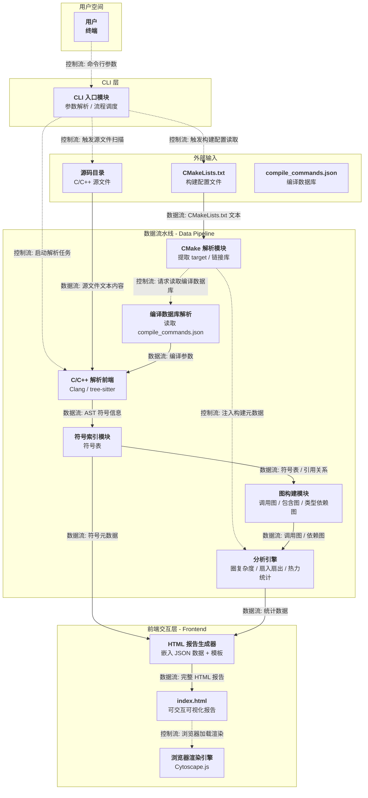
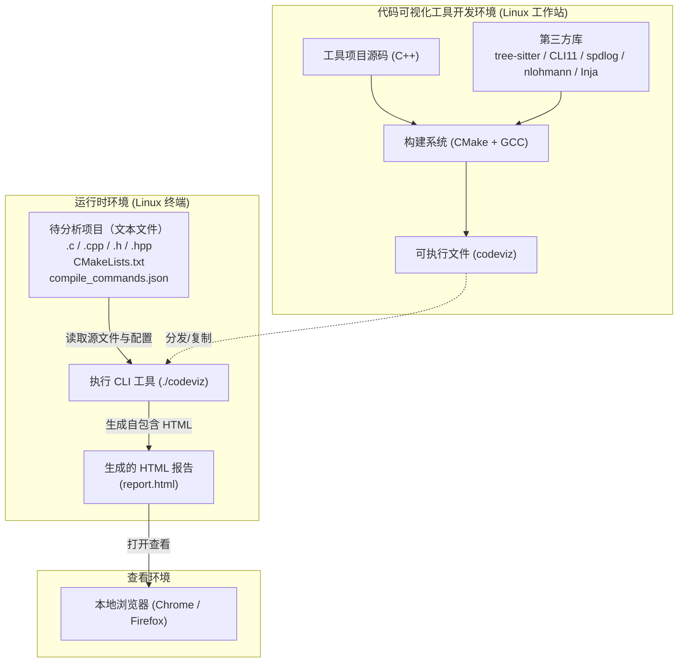
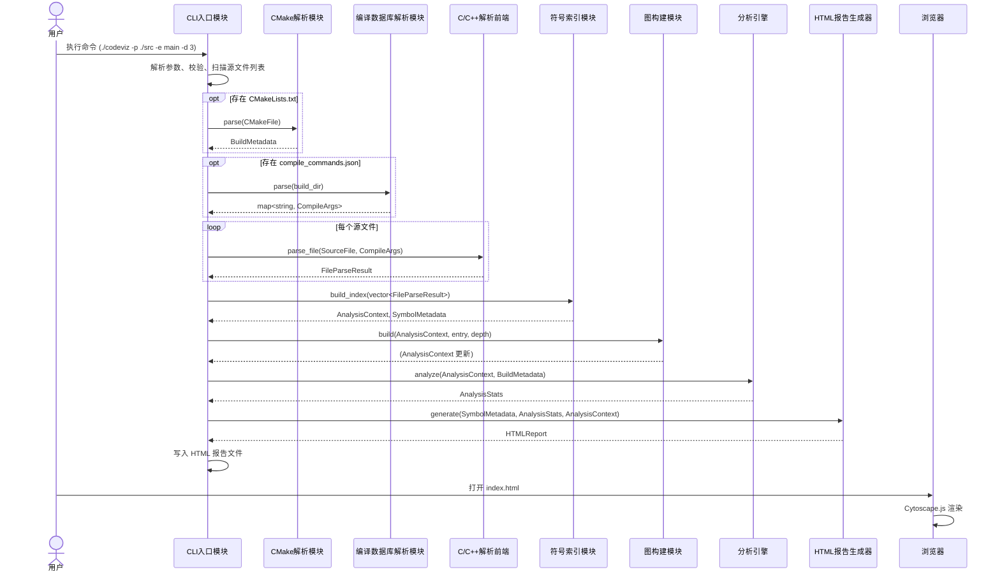
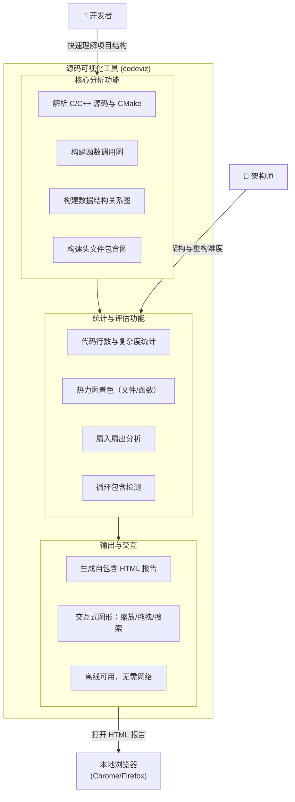
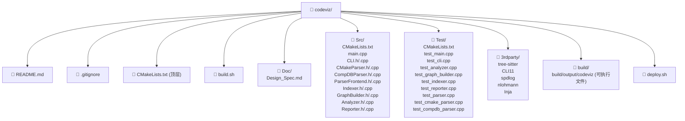
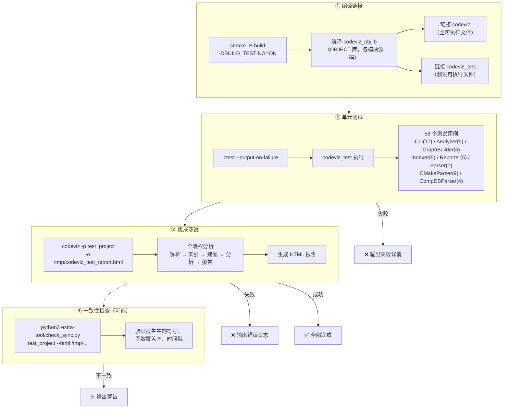

# 系统架构设计

> 来源: 从设计规格说明书提取的系统架构与视图。
> 原始文档: Doc/Code_Visualization_Tool_Design_Spec.md

## 3. 系统设计
定义工具的宏观架构、模块划分及模块间数据/控制流交互，作为后续详细设计与编码的基础。

### 3.1 顶层逻辑视图


### 3.2 物理视图


| 节点 | 说明 |
| :--- | :--- |
| 代码可视化工具开发环境 | 在开发者的 Linux 工作站上，使用 C++ 源码和第三方库（tree-sitter、CLI11 等），通过 CMake + GCC 编译生成独立可执行文件 codeviz。前端资源（Cytoscape.js）以字符串形式内嵌在可执行文件中，无需额外部署。 |
| 运行时环境 | 用户在 Linux 终端中执行 ./codeviz -p <项目路径> -o report.html。工具只读地读取待分析项目的源文件（.c/.cpp/.h/.hpp）、CMakeLists.txt 和 compile_commands.json（若存在），生成一个自包含的 HTML 文件（默认 <project_path>.html）。所有被分析对象均为纯文本文件，工具不运行或编译它们。 |
| 查看环境 | 用户双击或用浏览器打开生成的 HTML 报告，所有可视化渲染在用户本地浏览器中完成，无需网络连接（离线可用）。 |
| 虚线箭头 | 表示可执行文件的分发（从开发环境复制到运行环境）。 |


### 3.3 运行视图



### 3.4 场景视图




### 3.5 开发视图

| 目录/文件 | 用途 |
| :--- | :--- |
| CMakeLists.txt (顶层) | 定义项目名称、版本、子目录，汇总构建目标 |
| build.sh | 一键构建脚本（cmake -B build && cmake --build build，可执行文件输出到 build/output/codeviz） |
| Doc/ | 设计文档 |
| Src/CMakeLists.txt | 定义可执行目标、第三方库链接、输出目录（CMAKE_RUNTIME_OUTPUT_DIRECTORY = build/output/）|
| Src/ | 所有源代码，按模块分目录便于维护 |
| Src/CLI/ | CLI 入口 + 参数解析 + 流程调度 |
| Src/CMakeParser/ | CMake 构建配置解析 |
| Src/CompDBParser/ | compile_commands.json 解析 |
| Src/Parser/ | C/C++ 解析前端（tree-sitter 集成） |
| Src/Indexer/ | 符号索引与 AnalysisContext 构建 |
| Src/GraphBuilder/ | 调用图/包含图/类型依赖图构建 |
| Src/Analyzer/ | 统计分析引擎 |
| Src/Reporter/ | JSON 序列化 + Inja 模板渲染 |
| Src/Template/ | 前端模板及 JS 桥接参考文件（实际使用 Reporter.cpp 内嵌的 C++ string literal）|
| Src/main.cpp | 程序入口（main()），调用 CLI 模块函数 |
| Test/ | 单元测试目录，基于 doctest 框架 |
| Test/CMakeLists.txt | 测试构建配置，链接 codeviz_objlib |
| Test/test_main.cpp | doctest 入口，初始化日志后启动测试运行器 |
| Test/test_cli.cpp | CLI 模块辅助函数测试（17 用例） |
| Test/test_analyzer.cpp | Analyzer 模块测试（5 用例） |
| Test/test_graph_builder.cpp | GraphBuilder 模块测试（6 用例） |
| Test/test_indexer.cpp | Indexer 模块测试（5 用例） |
| Test/test_reporter.cpp | Reporter 模块测试（5 用例） |
| Test/test_parser.cpp | ParserFrontend 模块测试（7 用例） |
| Test/test_cmake_parser.cpp | CMakeParser 模块测试（9 用例） |
| Test/test_compdb_parser.cpp | CompDBParser 模块测试（4 用例） |
| 3rdparty/ | 第三方库，header-only 或源码，通过 CMake add_subdirectory 引入 |
| 3rdparty/doctest/ | 单头文件测试框架（doctest.h），从 nlohmann/json 测试目录提取 |
| deploy.sh | 运行环境检测脚本，检查可选运行时依赖（python3/git/firefox等）|
| build/ | 构建产物，.gitignore 中忽略 |


### 3.6 外部输入源
| 名称 | 功能 | 输入 | 输出 |
| :--- | :--- | :--- | :--- |
| **源码目录** | 存放待分析的 C/C++ 源文件（`.c`、`.cpp`、`.h`、`.hpp` 等） | 无（被动被读取） | 源文件文本内容 |
| **CMakeLists.txt** | 项目的 CMake 构建配置文件，描述构建目标、依赖和编译选项 | 无（被动被读取） | CMake 脚本文本 |
| **compile_commands.json** | CMake 生成的编译数据库，记录每个源文件的精确编译命令（宏定义、头文件路径、编译选项） | 无（被动被读取） | JSON 格式的编译参数记录 |

### 3.7 处理模块
| 名称 | 功能 | 输入 | 输出 |
| :--- | :--- | :--- | :--- |
| **CLI 入口模块** | 解析用户命令行参数（如入口函数、展开深度、输出路径），协调调度后续各解析模块的执行顺序，是整个工具的调度中心 | 命令行参数（`argv`） | 调度指令（触发源文件扫描、构建配置读取、启动解析任务） |
| **CMake 解析模块** | 递归读取并解析项目中的多级 `CMakeLists.txt` 文件，提取构建目标（`add_executable`、`add_library`）、链接库依赖（`target_link_libraries`）以及编译工具链信息 | `CMakeLists.txt` 文件文本 | 1. 目标依赖拓扑数据（target 名称、类型、链接库列表）<br>2. 编译工具链信息（`CMAKE_C_COMPILER`、`CMAKE_CXX_COMPILER`）<br>3. 对编译数据库解析模块的调用请求 |
| **编译数据库解析模块** | 读取 CMake 生成的 `compile_commands.json` 文件，为每个源文件提取精确的编译参数，包括宏定义（`-D`）、头文件搜索路径（`-I`）及其他编译选项 | `compile_commands.json` 文件内容（若存在） | 以源文件为键的编译参数映射表（宏、头文件路径、编译选项） |
| **C/C++ 解析前端** | 基于 tree-sitter 对 C/C++ 源文件进行语法分析，遍历具体语法树（CST），提取函数定义、函数调用点、结构体/类定义、字段声明、宏定义、#include 指令等符号信息 | 1. 源文件文本内容<br>2. 编译参数（来自编译数据库或默认推断） | 原始符号信息流（函数声明、调用关系、结构体/类定义、字段、包含关系等） |
| **符号索引模块** | 将解析前端输出的原始符号信息整理为结构化的符号表，建立符号名称到定义位置、类型、作用域的映射，并提供高效查询接口 | AST 符号信息流（函数、变量、类型等） | 1. 全局符号表（Symbol Table）<br>2. 符号引用关系索引（如某函数被哪些位置调用） |
| **图构建模块** | 基于符号表和引用关系，构建各类关系图：函数调用图（Call Graph）、头文件包含图（Include Graph）、类型依赖图（Type Dependency Graph） | 1. 符号表<br>2. 符号引用关系 | 1. 调用图（节点：函数，边：调用）<br>2. 包含图（节点：文件，边：`#include`）<br>3. 类型依赖图（节点：`struct`/`class`，边：包含/继承） |
| **分析引擎** | 对构建好的图数据和源码元数据进行统计分析，计算代码行数、圈复杂度、扇入扇出、被调用热度等指标，为热力图和异常检测提供数据支持 | 1. 调用图 / 包含图 / 类型依赖图<br>2. 符号表<br>3. 构建元数据（来自 CMake 解析模块） | 1. 文件级统计（代码行数、复杂度）<br>2. 函数级统计（扇入/扇出、被调用次数）<br>3. 异常关系报告（如循环包含） |
| **HTML 报告生成器** | 将符号索引、图数据、统计结果及渲染模板整合，生成一个自包含的 HTML 文件，其中嵌入 JSON 格式的分析数据，并通过 JavaScript 调用前端图库完成可视化渲染 | 1. 符号元数据<br>2. 统计数据（复杂度、热度等）<br>3. 图结构数据（调用图、包含图等）<br>4. 前端模板（HTML/CSS/JS 骨架） | 完整的 `index.html` 报告文件 |

### 3.8 前端渲染
| 名称 | 功能 | 输入 | 输出 |
| :--- | :--- | :--- | :--- |
| **浏览器渲染引擎** | 在用户浏览器中加载生成的 HTML 报告，解析内嵌的 JSON 数据，使用 Cytoscape.js 绘制交互式图形，响应缩放、拖拽、节点点击、侧边栏折叠等用户操作 | 内嵌在 HTML 中的 JSON 分析数据 + 用户交互事件 | 屏幕上的可交互图形界面 |

### 3.9 测试系统

#### 3.9.1 测试策略

采用三层测试体系保障工具质量：

| 层级 | 名称 | 定位 | 工具 |
|------|------|------|------|
| 单元测试 | 各模块独立测试，验证输入/输出正确性 | 快速反馈，覆盖正常路径和异常边界 | doctest |
| 集成测试 | test_project 端到端分析 | 验证全流程可运行 | codeviz + test_project |
| 一致性检查 | 检查 HTML 报告与源码是否一致 | 防止报告过期 | check_sync.py |

单元测试的核心约束：
- 测试目标与主目标**共用 OBJECT 库**（`codeviz_objlib`），源码编译一次，避免重复编译
- `main()` 独立于模块函数，测试目标不包含 `main()` 避免符号冲突
- 依赖文件系统的测试使用 `mkdtemp` 创建临时目录，测试结束后清理

#### 3.9.2 构建集成流程



#### 3.9.3 测试目录结构

```
Test/
  CMakeLists.txt         # 测试构建配置（链接 codeviz_objlib）
  test_main.cpp          # doctest 入口
  test_cli.cpp           # CLI 模块测试
  test_analyzer.cpp      # Analyzer 模块测试
  test_graph_builder.cpp # GraphBuilder 模块测试
  test_indexer.cpp       # Indexer 模块测试
  test_reporter.cpp      # Reporter 模块测试
  test_parser.cpp        # ParserFrontend 模块测试
  test_cmake_parser.cpp  # CMakeParser 模块测试
  test_compdb_parser.cpp # CompDBParser 模块测试
```

#### 3.9.4 测试元数据

| 指标 | 数值 |
|------|------|
| 测试框架 | doctest 2.4.12（单头文件）|
| 模块覆盖率 | 8/8 模块（100%）|
| 测试用例总数 | 58 |
| 断言总数 | 136 |
| 构建集成 | build.sh → ctest --output-on-failure |
