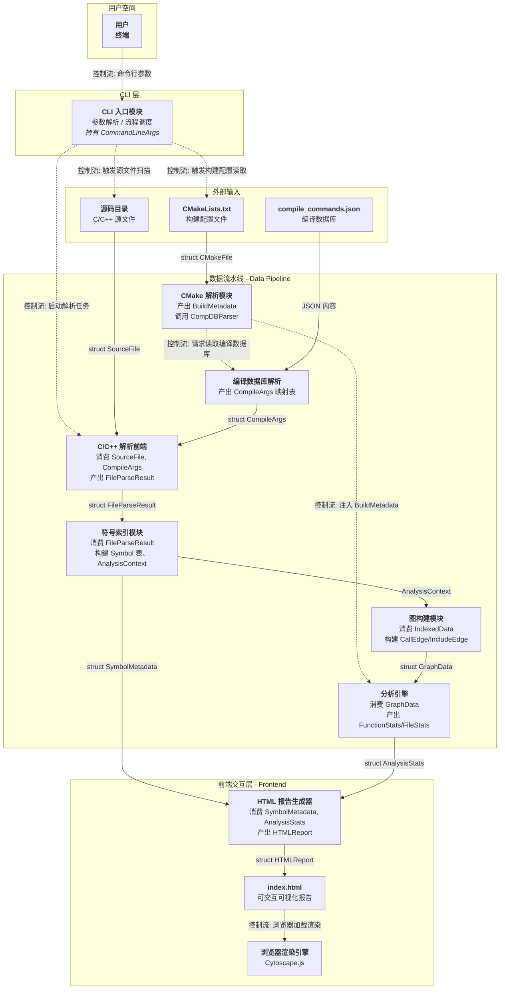

# 核心数据结构

> 来源: 从设计规格说明书提取的接口与核心数据结构。
> 原始文档: Doc/Code_Visualization_Tool_Design_Spec.md

### 4.2 核心数据结构
数据结构包括两层：
- 接口层：从系统框图的“数据和控制边”出发，定义每条边的交换数据结构，作为模块间的显式契约；
- 核心层：从消费者角度定义在消费者内部的数据模型，并且这些定义的数据结构具备高度抽象和共性而作为后端共享；
以下先定义接口数据，再根据接口数据和消费者内部的抽象需求，定义核心数据
#### 4.2.1 接口数据结构

1. CLI 到 C/C++解析器
流动内容：一个源文件的完整文本
```cpp
   struct SourceFile {
    std::string file_path;
    std::string content;
};
```
2. CLI 到 CMake解析器
流动内容：CMakeLists.txt 文件内容
```cpp
struct CMakeFile {
    std::string file_path;   // 用于定位和错误报告
    std::string content;     // 解析器的输入
    std::string source_dir;  // 解析相对路径的基准目录
};
```
3. 编译数据库(compile_commands.json)  -- C/C++解析器
流动内容：单个源文件对应的编译参数（宏定义、头文件路径）
```cpp
struct CompileArgs {
    std::string file_path;              // 关联到具体源文件
    std::vector<std::string> defines;   // -D 宏定义
    std::vector<std::string> includes;  // -I 头文件路径
    std::vector<std::string> flags;     // 其他编译选项
};
```
4. C/C++ 解析 -- 符号索引模块
流动内容：从单个源文件的 CST 中提取的原始符号和引用关系，尚未去重和全局索引
```cpp
struct RawSymbol {
    std::string name;                   // 符号名称（可能有重名）
    std::string file_path;              // 定义位置
    uint32_t line_start = 0, line_end = 0; // 行号范围
    enum Kind { FUNC, STRUCT, CLASS, ENUM_KIND, VAR, MACRO } kind = FUNC;
    std::vector<std::string> callee_names; // 调用的函数名（未解析为 ID）
    // 函数扩展信息（由 visit_function_declarator 填充）
    std::string return_type;
    std::vector<std::string> parameters;
    bool is_virtual = false;
    bool is_static = false;
    bool is_inline = false;
    int branch_count = 0;       // 分支节点数（由 ParserFrontend 统计）
    // 复合类型扩展信息
    std::vector<FieldInfo> fields;       // 成员字段
    std::vector<uint32_t> method_symbol_ids;
    std::vector<std::string> base_class_names; // 基类名称（未解析为 ID）
    AccessSpecifier access = AccessSpecifier::NONE;
};

struct FileParseResult {
    std::string file_path;
    std::vector<RawSymbol> symbols;
    std::vector<std::pair<std::string, std::string>> includes; // (includer, includee)
    int total_lines = 0;      // 文件总行数
    int code_lines = 0;       // 有效代码行数
    int comment_lines = 0;    // 注释行数
};
```
5. 符号索引模块 --> 图构建模块
流动内容：已填充的 AnalysisContext（含去重后的全局符号表及引用关系，通过 AnalysisContext 直接传递）
```cpp
struct SymbolRef {
    uint32_t from_symbol_id;   // 引用者
    uint32_t to_symbol_id;     // 被引用者
    uint32_t line;             // 引用位置（用于 UI 跳转）
    std::string file_path;     // 引用发生的文件
};

struct IndexedData {
    std::vector<Symbol> symbols;      // 全局符号表（复用 4.2 定义）
    std::vector<SymbolRef> references; // 所有引用关系
};
```
6. 图构建模块 --> 分析引擎
流动内容：结构化的图数据，便于分析引擎遍历和计算
```cpp
struct GraphNode {
    uint32_t id;           // 对应 Symbol ID 或 File ID
    std::string label;
    enum Type { FUNCTION, FILE_ENTITY, STRUCT } type;
};

struct GraphEdge {
    uint32_t source_id;
    uint32_t target_id;
    enum Relation { CALLS, INCLUDES, CONTAINS, INHERITS } relation;
    uint32_t weight;       // 调用次数或包含次数（用于热力计算）
};

struct GraphData {
    std::vector<GraphNode> nodes;
    std::vector<GraphEdge> edges;
};
```
7. 符号索引模块 --> HTML 报告生成器
流动内容：供报告生成器直接使用的符号基础信息（无需图结构）
```cpp
struct SymbolMetadata {
    uint32_t symbol_id;
    std::string name;
    std::string qualified_name;
    std::string file_path;
    uint32_t line;
    enum SymbolKind kind;
    int complexity;   // 待 Analyzer 填充后回填或二次传递
    int fan_in;
    int fan_out;
};
```
8. 分析引擎-->HTML 报告生成器
流动内容：分析引擎计算出的统计指标和异常报告。
```cpp
struct FileStats {
    std::string file_path;
    int total_lines;
    int code_lines;
    double complexity_sum;   // 该文件所有函数的复杂度总和
};

struct FunctionStats {
    uint32_t function_id;
    int fan_in;
    int fan_out;
    int cyclomatic_complexity;
};

struct CircularInclude {
    std::vector<std::string> file_cycle;
};

struct AnalysisStats {
    std::vector<FileStats> file_stats;
    std::vector<FunctionStats> function_stats;
    std::vector<CircularInclude> circular_includes;
};

/// 外部符号引用（来自未在本项目中定义的函数/变量）
struct ExternalRef {
    std::string caller_name;   // 调用者符号名
    std::string callee_name;   // 被调用者符号名（外部）
    std::string library;       // 推测的库名
};
```
9. HTML 报告生成器 -->文件系统
流动内容：最终生成的 HTML 文件内容。
```cpp
struct HTMLReport {
    std::string content;     // 完整 HTML 字符串
    std::string output_path; // 建议的输出路径
};
```
#### 4.2.2 核心数据结构

```cpp
// 符号类型枚举（从 RawSymbol::Kind 抽象并扩展）
enum class SymbolKind {
    FUNCTION,       // 函数（含成员函数）
    STRUCT,         // 结构体
    CLASS,          // 类
    ENUM,           // 枚举
    VARIABLE,       // 全局变量
    MACRO,          // 宏定义
    FILE_ENTITY     // 文件实体（用于包含图）
};

// 访问修饰符（C++ 专用，从 CST 的 access_specifier 节点提取）
enum class AccessSpecifier {
    PUBLIC,
    PROTECTED,
    PRIVATE,
    NONE           // C 语言或全局符号
};

// 全局符号表的基础存储单元
struct Symbol {
    uint32_t id;                    // 唯一标识符（由 Indexer 自增分配）
    std::string name;               // 符号短名称（如 "main"）
    std::string qualified_name;     // 完全限定名（如 "namespace::Class::method"）
    std::string file_path;          // 定义所在文件的绝对路径
    uint32_t line_start;            // 定义起始行号
    uint32_t line_end;              // 定义结束行号
    SymbolKind kind;                // 符号类型
    AccessSpecifier access;         // 访问修饰符
    std::vector<uint32_t> references; // 引用该符号的 SymbolRef 索引（由 Indexer 填充）
};

// 从 RawSymbol 中提取函数特有信息，并由 Analyzer 补充统计字段
struct FunctionSymbol {
    uint32_t symbol_id;             // 关联到 Symbol::id
    std::string return_type;        // 返回值类型字符串
    std::vector<std::string> parameters; // 参数类型列表
    std::string comment;            // Doxygen 注释文档（ParserFrontend 提取）
    bool is_virtual;                // 虚函数标记
    bool is_static;                 // 静态函数标记
    bool is_inline;                 // 内联函数标记
    int cyclomatic_complexity;      // 圈复杂度（由 Analyzer 计算）
    int branch_count;               // 分支节点数（ParserFrontend 统计）
    int fan_in;                     // 被调用次数（由 Analyzer 计算）
    int fan_out;                    // 调用其他函数数量（由 Analyzer 计算）
    std::vector<uint32_t> callees;  // 调用的函数 Symbol ID 列表
};

// 成员字段信息（对应需求 2.2.3.3 DR_3：成员名、类型、偏移、长度）
struct FieldInfo {
    std::string name;               // 成员名称
    std::string type;               // 成员类型字符串
    uint32_t offset;                // 字节偏移（若可获取）
    size_t size;                    // 成员大小（字节）
    AccessSpecifier access;         // 访问修饰符
};

// 结构体/类符号
struct CompositeSymbol {
    uint32_t symbol_id;             // 关联到 Symbol::id
    std::vector<FieldInfo> fields;  // 成员字段列表
    std::vector<uint32_t> methods;  // 成员函数 Symbol ID 列表
    std::vector<uint32_t> base_classes; // 基类 Symbol ID 列表
    std::string comment;            // Doxygen 注释文档（ParserFrontend 提取）
    bool is_pod;                    // 是否为平凡类型
    size_t total_size;              // 类型总大小（字节）
};

// 用于包含图构建和文件级统计
struct FileSymbol {
    uint32_t symbol_id;             // 关联到 Symbol::id
    int total_lines;                // 总行数
    int code_lines;                 // 有效代码行数
    int comment_lines;              // 注释行数
    std::vector<uint32_t> includes; // 包含的头文件 Symbol ID 列表
    std::vector<uint32_t> symbols;  // 本文件内定义的符号 ID 列表
};

// 调用边（从 SymbolRef 中 relation == CALLS 抽象）
struct CallEdge {
    uint32_t caller_id;             // 调用者 Symbol ID
    uint32_t callee_id;             // 被调用者 Symbol ID
    uint32_t call_count;            // 调用次数（静态计数）
    uint32_t line;                  // 调用发生的行号
    std::string file_path;          // 调用发生的文件
};

// 包含边（从 FileParseResult::includes 抽象）
struct IncludeEdge {
    uint32_t includer_id;           // 包含者文件 Symbol ID
    uint32_t includee_id;           // 被包含头文件 Symbol ID
    uint32_t line;                  // #include 所在行号
    bool is_system;                 // 是否为系统头文件（<> 形式）
};

// 类型依赖边（用于 CompositeSymbol 之间的关系）
struct TypeDependencyEdge {
    uint32_t source_id;             // 源类型 Symbol ID
    uint32_t target_id;             // 目标类型 Symbol ID
    enum Relation { CONTAINS, INHERITS, PARAMETER, RETURN } relation;
};

// 贯穿整个后端流程的统一数据容器
struct AnalysisContext {
    // 符号表（核心存储）
    std::vector<Symbol> symbols;
    std::unordered_map<std::string, uint32_t> symbol_name_to_id; // 完全限定名 → ID
    
    // 分类型符号池（便于快速遍历，存储索引而非完整对象）
    std::vector<FunctionSymbol> functions;
    std::vector<CompositeSymbol> composites;
    std::vector<FileSymbol> files;
    
    // 图边数据
    std::vector<CallEdge> call_edges;
    std::vector<CallEdge> full_call_edges; // BFS 剪枝前的完整调用边（前端按需展开用）
    std::vector<IncludeEdge> include_edges;
    std::vector<TypeDependencyEdge> type_edges;
    std::vector<SymbolRef> references;

    // 命令行参数（用于报告展示）
    std::string command_line;

    // 入口函数 Symbol ID（由 GraphBuilder 填充，Reporter 序列化到前端）
    uint32_t entry_function_id = 0;

    // 外部符号引用
    std::vector<ExternalRef> external_refs;

    // 项目元数据
    std::string project_root;
    std::vector<std::string> source_files;
    std::unordered_map<std::string, CompileArgs> compile_params; // 文件 → 编译参数
    
    // 构建元数据（来自 CMake 解析模块）
    std::string cmake_version;
    std::string c_compiler;
    std::string cxx_compiler;
    std::vector<std::string> targets;
    std::unordered_map<std::string, std::vector<std::string>> target_link_libs;
};
```
将数据结构定义结合到系统框图中，如下表示：

