# 示例

> 来源: 从设计规格说明书提取的使用示例。
> 原始文档: Doc/Code_Visualization_Tool_Design_Spec.md

## 5. 举例

以“单个 c 文件” 为例，说明内部调用过程

### 5.1 调用和数据流

```mermaid
flowchart TD
    classDef default fill:#f9f9f9,stroke:#333,stroke-width:1px;
    classDef interface fill:#e1f5fe,stroke:#0288d1,stroke-dasharray: 5 5;

    subgraph Input["输入: 单个 .c 文件"]
        CFile["example.c"]
    end

    subgraph CLI["CLI入口模块"]
        direction LR
        CLI_IF["对外接口<br>int main<br>(int argc, char* argv[])"]:::interface
        A1["parse_arguments"] --> A2["validate_arguments"]
        A2 --> A3["scan_source_files"]
        A3 --> A4["读取文件到 SourceFile"]
        CLI_IF -.-> A1
        A1 -->|"CommandLineArgs"| A2
    end

    subgraph ParserFrontend["C/C++ 解析前端"]
        direction TB
        PF_IF["对外接口<br>FileParseResult parse_file<br>(const SourceFile&, const CompileArgs&)"]:::interface
        B1["init_parser(ext)"] --> B2["ts_parser_parse_string"]
        B2 --> B3["traverse_cst 遍历节点"]
        B3 --> B4["visit_function_definition<br>创建 RawSymbol<FUNC>"]
        B3 --> B5["visit_call_expression<br>填充 callee_names"]
        B3 --> B6["visit_struct_specifier<br>创建 RawSymbol<STRUCT>"]
        B3 --> B7["visit_preproc_include<br>记录 includes"]
        B4 --> B8["返回 FileParseResult"]
        B5 --> B8
        B6 --> B8
        B7 --> B8
        PF_IF -.-> B1
    end

    subgraph Indexer["符号索引模块"]
        direction TB
        IDX_IF1["对外接口1<br>AnalysisContext build_index<br>(const vector&lt;FileParseResult&gt;&amp;)"]:::interface
        IDX_IF2["对外接口2<br>vector&lt;SymbolMetadata&gt; export_metadata<br>(const AnalysisContext&amp;)"]:::interface
        D1["build_index"] --> D2["init_context"]
        D2 --> D3["第一遍遍历 FileParseResult"]
        D3 --> D4["get_or_create_symbol_id<br>convert_to_symbol<br>存入 ctx.symbols"]
        D4 --> D5["extract_function_detail<br>extract_composite_detail<br>存入 ctx 分类型池"]
        D5 --> D6["第二遍遍历 FileParseResult"]
        D6 --> D7["process_calls: callee_names -> CallEdge<br>process_includes: includes -> IncludeEdge"]
        D7 --> D8["fill_reverse_references"]
        D8 --> D9["返回 AnalysisContext"]
        IDX_IF1 -.-> D1
        IDX_IF2 -.->|"由 Reporter 调用"| D9
    end

    subgraph GraphBuilder["图构建模块"]
        direction TB
        GB_IF1["对外接口1<br>void build<br>(AnalysisContext&, const string&, int)"]:::interface
        GB_IF2["对外接口2<br>GraphData export_graph_data<br>(const AnalysisContext&)"]:::interface
        E1["build"] --> E2["find_entry_id"]
        E2 --> E3["build_call_graph BFS 遍历<br>生成 CallEdge"]
        E3 --> E4["build_include_graph<br>生成 IncludeEdge"]
        E4 --> E5["build_type_dependency_graph<br>生成 TypeDependencyEdge"]
        E5 --> E6["compute_fan_in / fan_out<br>回填 FunctionSymbol"]
        E6 --> E7["导出 GraphData"]
        GB_IF1 -.-> E1
        GB_IF2 -.-> E7
    end

    subgraph Analyzer["分析引擎"]
        direction TB
        ANZ_IF["对外接口<br>AnalysisStats analyze<br>(const AnalysisContext&, const BuildMetadata&)"]:::interface
        F1["analyze"] --> F2["compute_function_stats"]
        F2 --> F3["compute_file_stats"]
        F3 --> F4["detect_circular_includes"]
        F4 --> F5["compute_hotspots"]
        F5 --> F6["返回 AnalysisStats"]
        ANZ_IF -.-> F1
    end

    subgraph Reporter["HTML报告生成器"]
        direction TB
        RPT_IF["对外接口<br>HTMLReport generate<br>(const vector&lt;SymbolMetadata&gt;&amp;, const AnalysisStats&amp;, const AnalysisContext&amp;)"]:::interface
        G1["generate"] --> G2["load_template"]
        G2 --> G3["build_json 组装数据"]
        G3 --> G4["convert_call_graph / include_graph / type_graph"]
        G4 --> G5["Inja 模板渲染"]
        G5 --> G6["输出 HTMLReport"]
        RPT_IF -.-> G1
    end

    subgraph Output["输出"]
        HTML["report.html"]
    end

    %% 数据流
    CFile --> CLI
    CLI -->|"SourceFile: file_path + content"| ParserFrontend
    ParserFrontend -->|"FileParseResult (RawSymbols, includes)"| Indexer
    Indexer -->|"AnalysisContext (symbols, call_edges, include_edges...)"| GraphBuilder
    Indexer -->|"SymbolMetadata 列表"| Reporter
    GraphBuilder -->|"GraphData"| Analyzer
    Analyzer -->|"AnalysisStats"| Reporter
    Reporter -->|"HTMLReport"| HTML

    %% 控制流
    CLI -.->|"控制流"| ParserFrontend
    CLI -.->|"控制流"| Indexer
    CLI -.->|"控制流"| GraphBuilder
    CLI -.->|"控制流"| Analyzer
    CLI -.->|"控制流"| Reporter
```

### 5.2 说明
1. CLI 入口模块：解析参数，扫描到 example.c，读取内容生成 SourceFile 数据包。
2. C/C++ 解析前端：接收 SourceFile，使用 tree-sitter 解析 CST，通过 visit_* 函数提取函数定义、调用、结构体、包含关系等，组装成 FileParseResult（内含 RawSymbol 和 includes 列表）。
3. 符号索引模块：两遍遍历所有 FileParseResult：
- 第一遍：分配 ID，将 RawSymbol 转换为核心 Symbol、FunctionSymbol、CompositeSymbol、FileSymbol，构建出 AnalysisContext 的符号表。
- 第二遍：解析调用和包含关系，生成 CallEdge、IncludeEdge 存入 ctx，并填充 SymbolRef，最后补充反向引用。
4. 图构建模块：基于 AnalysisContext 中的边和符号，按入口函数进行 BFS 生成调用图，构建包含图和类型依赖图，并计算扇入扇出，回填到 FunctionSymbol 中。同时可按需导出 GraphData 给分析引擎。
5. 分析引擎：基于 AnalysisContext 的图和符号计算圈复杂度、文件统计、循环包含检测、热力值，生成 AnalysisStats。
6. HTML 报告生成器：从索引模块获取 SymbolMetadata，从分析引擎获取 AnalysisStats，结合 AnalysisContext 中的图边数据，通过 Inja 模板渲染成 HTMLReport，最终写入磁盘。