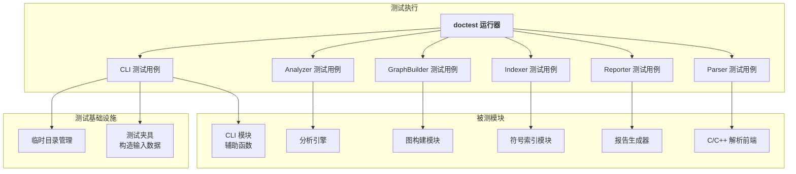
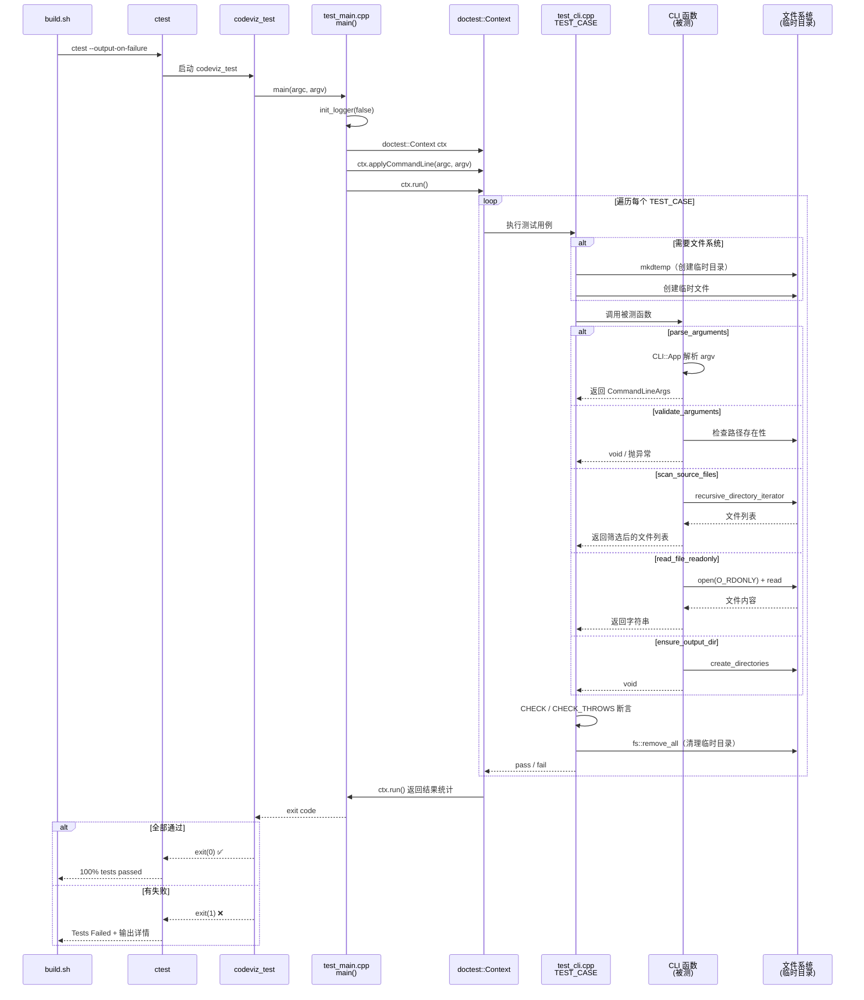
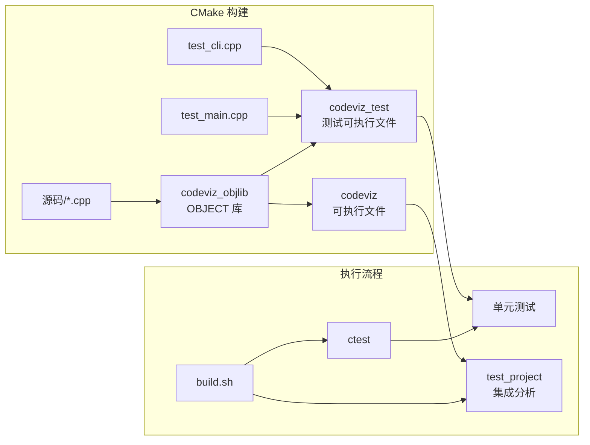

# 单元测试方案

> 文档维护: 随测试进展持续更新
> 最近更新: 2026-05-14

## 总体测试方案

### 测试目标

对 codeviz 各模块进行独立单元测试，验证每个模块在给定输入下的输出正确性，覆盖正常路径和异常边界。

### 测试框架

使用 **doctest**（单头文件，零外部依赖），头文件位于 `3rdparty/doctest/doctest.h`，从 nlohmann/json 测试目录中提取。

### 测试层级

```
层级1: 单元测试（当前阶段）
  └─ 每个模块独立测试，mock 化外部依赖（文件系统等）
  └─ 纯函数优先，输入/输出均为内存数据结构

层级2: 集成测试（test_project）
  └─ 全流程端到端验证
  └─ 自动在 build.sh 中执行

层级3: 一致性检查（check_sync.py）
  └─ 验证 HTML 报告与源码的一致性
```

### 构建集成

测试已集成到 CMake 构建系统：

- `BUILD_TESTING=ON`（默认启用）时，生成 `codeviz_test` 可执行目标
- 测试目标与主目标**共用 OBJECT 库**（`codeviz_objlib`），避免重复编译
- `build.sh` 中构建完成后自动执行：`ctest --output-on-failure`
- 随后自动运行 test_project 集成分析

### 测试目录结构

```
Test/
  CMakeLists.txt         # 测试构建配置
  test_main.cpp          # doctest 入口（初始化日志 + 启动测试运行器）
  test_cli.cpp           # CLI 模块测试（17 用例）
  test_analyzer.cpp      # Analyzer 模块测试（5 用例）
  test_graph_builder.cpp # GraphBuilder 模块测试（6 用例）
  test_indexer.cpp       # Indexer 模块测试（5 用例）
  test_reporter.cpp      # Reporter 模块测试（5 用例）
  test_parser.cpp        # ParserFrontend 模块测试（7 用例）
  test_cmake_parser.cpp  # CMakeParser 模块测试（9 用例）
  test_compdb_parser.cpp # CompDBParser 模块测试（4 用例）
```

### 总体进展

| 模块 | 测试用例 | 断言数 | 状态 |
|------|---------|--------|------|
| CLI | 17 | 51 | ✅ |
| Analyzer | 5 | 14 | ✅ |
| GraphBuilder | 6 | 10 | ✅ |
| Indexer | 5 | 16 | ✅ |
| Reporter | 5 | 11 | ✅ |
| ParserFrontend | 7 | 10 | ✅ |
| CMakeParser | 9 | 13 | ✅ |
| CompDBParser | 4 | 11 | ✅ |
| **合计** | **58** | **136** | **全部通过** |

---

## 系统框架

### 测试逻辑视图



### 测试运行视图



### 模块可测试性

| 模块 | 输入形式 | 输出形式 | 外部依赖 | 可测试性 |
|------|---------|---------|---------|---------|
| CLI | argc/argv, CommandLineArgs, 目录路径 | 结构体, void(异常) | 文件系统 | ⭐⭐⭐⭐ |
| Analyzer | AnalysisContext (const) | AnalysisStats | 无 | ⭐⭐⭐⭐⭐ |
| GraphBuilder | AnalysisContext (in/out) | 无(修改ctx) | 无 | ⭐⭐⭐⭐⭐ |
| Indexer | vector\<FileParseResult\> | AnalysisContext | 无 | ⭐⭐⭐⭐⭐ |
| Reporter | SymbolMetadata + Stats + Context | HTMLReport(string) | 无 | ⭐⭐⭐⭐⭐ |
| ParserFrontend | SourceFile(string) | FileParseResult | tree-sitter | ⭐⭐⭐⭐ |
| CMakeParser | CMakeFile(struct) | BuildMetadata | tree-sitter-cmake | ⭐⭐⭐⭐ |
| CompDBParser | 目录路径 | compile_args map | 文件系统 | ⭐⭐⭐ |

### 构建结构



### 关键设计决策

1. **OBJECT 库共用编译产物**：源码编译一次，主程序和测试程序共用，保持构建速度
2. **main() 分离**：`CLI.cpp` 仅包含辅助函数，`main.cpp` 独立存放，测试目标不包含 `main()` 避免符号冲突
3. **临时目录管理**：依赖文件系统的测试使用 `mkdtemp` 创建临时目录，测试结束后清理
4. **spdlog 初始化**：测试运行器启动时调用 `init_logger(false)`，供测试中调用的 CLI 函数使用

---

## 各模块测试情况

### CLI 模块

**状态**: ✅ 已完成（2026-05-14）

**测试文件**: `Test/test_cli.cpp`

**测试框架集成**: `doctest`, 共 **17** 个测试用例, **51** 个断言

#### parse_arguments

| # | 测试用例 | 输入 | 预期 | 结果 |
|---|---------|------|------|------|
| 1 | 基本参数 | `-p /tmp` | project_path=/tmp, depth=2, entry=main | ✅ |
| 2 | 全参数 | `-p /tmp -e run -d 5 -v` | 全部字段正确解析 | ✅ |
| 3 | 长选项 | `--project /tmp --entry run --depth 3 --output /tmp/r.html` | 长选项正确解析 | ✅ |

#### validate_arguments

| # | 测试用例 | 输入 | 预期 | 结果 |
|---|---------|------|------|------|
| 4 | 有效参数 | path=/tmp, depth=5 | 不抛异常 | ✅ |
| 5 | depth 越下界 | depth=0 | 抛 invalid_argument | ✅ |
| 6 | depth 越上界 | depth=21 | 抛 invalid_argument | ✅ |
| 7 | 路径不存在 | path 不存在 | 抛 invalid_argument | ✅ |
| 8 | 路径是文件 | path 指向文件 | 抛 invalid_argument | ✅ |

#### scan_source_files

| # | 测试用例 | 输入 | 预期 | 结果 |
|---|---------|------|------|------|
| 9 | 空目录 | 空临时目录 | 返回空列表 | ✅ |
| 10 | 包含源文件 | 含 .cpp/.h/.md 的目录 | 只返回 .cpp 和 .h | ✅ |
| 11 | 跳过 build 目录 | 含 build/ 子目录 | 结果不含 build/ 下文件 | ✅ |
| 12 | 跳过 CMakeFiles | 含 CMakeFiles/ 子目录 | 结果不含 CMakeFiles/ 下文件 | ✅ |

#### read_file_readonly

| # | 测试用例 | 输入 | 预期 | 结果 |
|---|---------|------|------|------|
| 13 | 成功读取 | 临时文件内容 "hello world" | 内容匹配 | ✅ |
| 14 | 读取空文件 | 空临时文件 | 返回空字符串 | ✅ |
| 15 | 文件不存在 | 不存在的路径 | 抛 runtime_error | ✅ |

#### ensure_output_dir

| # | 测试用例 | 输入 | 预期 | 结果 |
|---|---------|------|------|------|
| 16 | 新建目录 | 不存在的子目录 | 目录被创建 | ✅ |
| 17 | 目录已存在 | 已有目录 | 不抛异常 | ✅ |

---

### Analyzer 模块

**状态**: ✅ 已完成（2026-05-14）

**测试文件**: `Test/test_analyzer.cpp`

**测试概要**: 5 个测试用例

| # | 测试用例 | 说明 | 结果 |
|---|---------|------|------|
| 1 | 空上下文返回空统计 | 无数据时所有统计字段为空 | ✅ |
| 2 | 圈复杂度 = branch_count + 1 | 核心公式验证 | ✅ |
| 3 | 扇入扇出统计 | 函数间调用关系统计 | ✅ |
| 4 | 文件统计累加 | 多文件行数汇总 | ✅ |
| 5 | 循环包含检测 | Tarjan SCC 算法验证 | ✅ |

---

### GraphBuilder 模块

**状态**: ✅ 已完成（2026-05-14）

**测试文件**: `Test/test_graph_builder.cpp`

**测试概要**: 6 个测试用例

| # | 测试用例 | 说明 | 结果 |
|---|---------|------|------|
| 1 | 空上下文不崩溃 | 退化输入容错 | ✅ |
| 2 | 入口函数 ID 正确 | 根据函数名查找 ID | ✅ |
| 3 | BFS 深度控制展开范围 | depth=1 只展开一级 | ✅ |
| 4 | 扇入扇出基于全量边计算 | BFS 剪枝前计算 | ✅ |
| 5 | full_call_edges 保留完整调用图 | 原始边不被裁剪 | ✅ |
| 6 | 入口函数不存在时 entry_id 为 0 | 回退行为验证 | ✅ |

---

### Indexer 模块

**状态**: ✅ 已完成（2026-05-14）

**测试文件**: `Test/test_indexer.cpp`

**测试概要**: 5 个测试用例

| # | 测试用例 | 说明 | 结果 |
|---|---------|------|------|
| 1 | 空解析结果 | 无输入时各字段为空 | ✅ |
| 2 | 单个函数创建对应符号 | 符号表、函数签名正确 | ✅ |
| 3 | 调用边生成 | callee_names → CallEdge | ✅ |
| 4 | 包含边生成 | includes → IncludeEdge | ✅ |
| 5 | 同名函数 Symbol ID 合并 | 同一文件内同名符号 ID 一致 | ✅ |

---

### Reporter 模块

**状态**: ✅ 已完成（2026-05-14）

**测试文件**: `Test/test_reporter.cpp`

**测试概要**: 5 个测试用例

| # | 测试用例 | 说明 | 结果 |
|---|---------|------|------|
| 1 | 空数据生成有效 HTML | 含 CODEVIZ_DATA 和 HTML 结构 | ✅ |
| 2 | 符号元数据写入 JSON | 符号名出现在 HTML 中 | ✅ |
| 3 | 运行命令写入 JSON | command_line 字段传递正确 | ✅ |
| 4 | 统计数据写入 HTML | 函数和文件统计可见 | ✅ |
| 5 | 调用图边去重合并 weight | 重复边 call_count 求和 | ✅ |

---

### ParserFrontend 模块

**状态**: ✅ 已完成（2026-05-14）

**测试文件**: `Test/test_parser.cpp`

**测试概要**: 7 个测试用例

| # | 测试用例 | 说明 | 结果 |
|---|---------|------|------|
| 1 | 空源码 | 空字符串解析不崩溃 | ✅ |
| 2 | 函数定义 | 提取函数名、行号范围 | ✅ |
| 3 | 函数调用 | callee_names 包含被调函数 | ✅ |
| 4 | #include 指令 | 系统头文件和本地头文件均被提取 | ✅ |
| 5 | 宏定义 | MACRO 类型符号提取 | ✅ |
| 6 | 结构体定义 | STRUCT 类型符号提取 | ✅ |
| 7 | 类定义 | CLASS 类型符号提取 | ✅ |

---

### CMakeParser 模块

**状态**: ✅ 已完成（2026-05-14）

**测试文件**: `Test/test_cmake_parser.cpp`

**测试概要**: 9 个测试用例

| # | 测试用例 | 说明 | 结果 |
|---|---------|------|------|
| 1 | 空内容 | 空字符串不视为错误 | ✅ |
| 2 | project 指令 | 提取项目名称 | ✅ |
| 3 | add_executable | 提取可执行目标 | ✅ |
| 4 | add_library | 提取库目标 | ✅ |
| 5 | target_link_libraries | 提取链接库依赖 | ✅ |
| 6 | cmake_minimum_required | 提取 CMake 版本 | ✅ |
| 7 | 设置编译器 | 提取 C/C++ 编译器路径 | ✅ |
| 8 | add_subdirectory | 提取子目录路径 | ✅ |
| 9 | 错误语法容错 | 不完整语法不崩溃 | ✅ |

---

### CompDBParser 模块

**状态**: ✅ 已完成（2026-05-14）

**测试文件**: `Test/test_compdb_parser.cpp`

**测试概要**: 4 个测试用例

| # | 测试用例 | 说明 | 结果 |
|---|---------|------|------|
| 1 | 文件不存在返回空映射 | 无 compile_commands.json 时容错 | ✅ |
| 2 | 单条编译条目 | 提取 -D 宏和 -I 路径 | ✅ |
| 3 | 多条编译条目 | 每个文件对应一条记录 | ✅ |
| 4 | 多参数提取 | 多个 -D 和 -I 均被提取 | ✅ |
- `normalize_path`: 路径规范化
- 编译数据库不存在的容错行为
