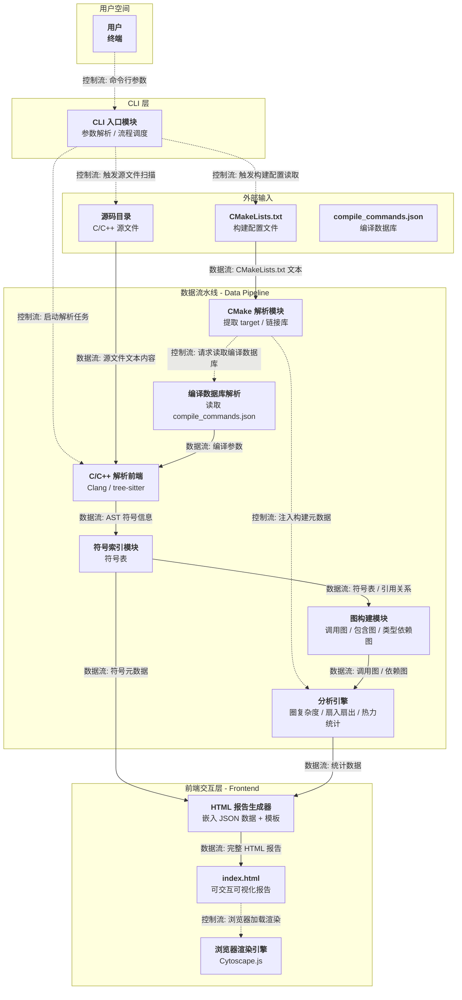
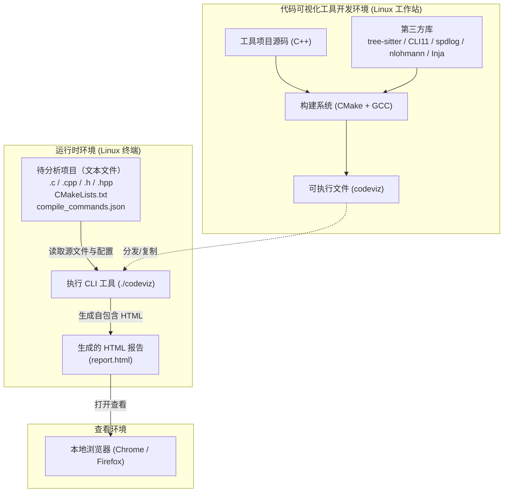
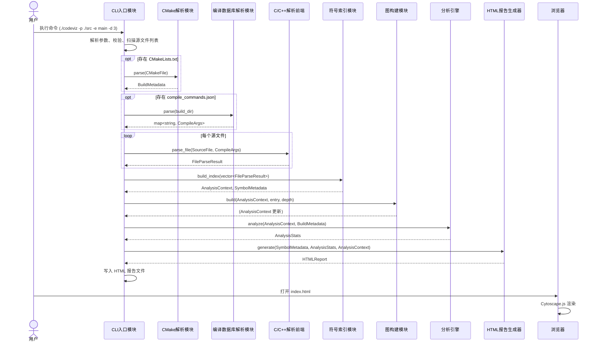
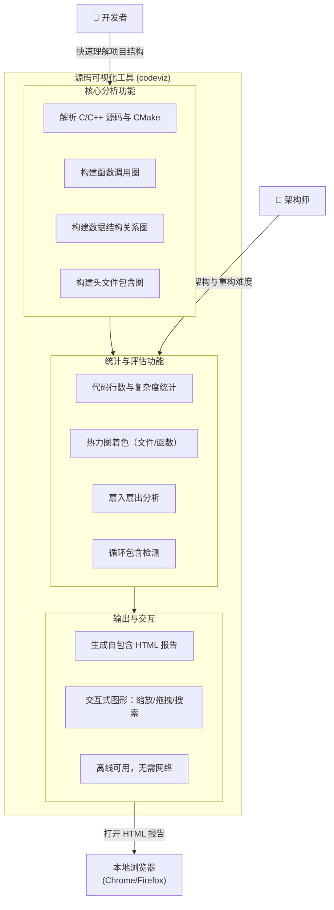
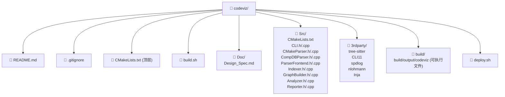
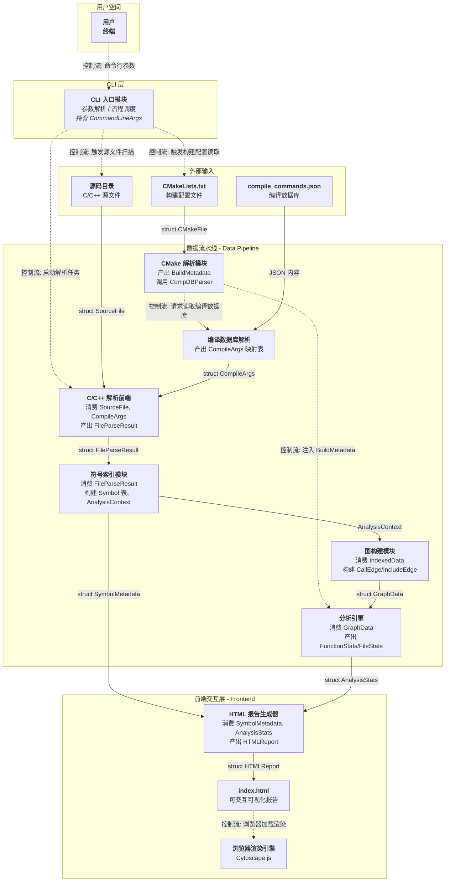

# 源码可视化分析工具
- [源码可视化分析工具](#源码可视化分析工具)
  - [0.背景](#0背景)
  - [1. 场景分析](#1-场景分析)
    - [1.1 用户角色](#11-用户角色)
    - [1.2 场景](#12-场景)
      - [1.2.1 场景1：分析 C/C++ 的已有项目源码](#121-场景1分析-cc-的已有项目源码)
      - [1.2.2 场景2：命令行后端和浏览器前端组合](#122-场景2命令行后端和浏览器前端组合)
      - [1.2.3 场景3：热力分析](#123-场景3热力分析)
      - [1.2.4 场景4：分析编译构建配置](#124-场景4分析编译构建配置)
  - [2. 需求分析](#2-需求分析)
    - [2.1 IR\_1: 项目基于 Linux 环境运行](#21-ir_1-项目基于-linux-环境运行)
    - [2.2 IR\_2:仅对 C/C++ 源码项目分析](#22-ir_2仅对-cc-源码项目分析)
    - [2.3 IR\_3:支持保护被分析项目的源文件](#23-ir_3支持保护被分析项目的源文件)
    - [2.4 IR\_4:支持CMake构建系统分析](#24-ir_4支持cmake构建系统分析)
    - [2.5 IR\_5:生成基于 HTML 的分析结果](#25-ir_5生成基于-html-的分析结果)
    - [2.6 IR\_6: 支持运行环境的自动部署](#26-ir_6-支持运行环境的自动部署)
    - [2.7 IR\_7: 编译构建](#27-ir_7-编译构建)
  - [3. 系统设计](#3-系统设计)
    - [3.1 顶层逻辑视图](#31-顶层逻辑视图)
    - [3.2 物理视图](#32-物理视图)
    - [3.3 运行视图](#33-运行视图)
    - [3.4 场景视图](#34-场景视图)
    - [3.5 开发视图](#35-开发视图)
    - [3.6 外部输入源](#36-外部输入源)
    - [3.7 处理模块](#37-处理模块)
    - [3.8 前端渲染](#38-前端渲染)
  - [4. 详细设计](#4-详细设计)
    - [4.1 关键技术选型](#41-关键技术选型)
      - [4.1.1 源码解析框架](#411-源码解析框架)
      - [4.1.2 前端图形渲染框架](#412-前端图形渲染框架)
      - [4.1.3 技术路线和选型汇总](#413-技术路线和选型汇总)
    - [4.2 核心数据结构](#42-核心数据结构)
      - [4.2.1 接口数据结构](#421-接口数据结构)
      - [4.2.2 核心数据结构](#422-核心数据结构)
    - [4.3 模块详细设计](#43-模块详细设计)
      - [4.3.1 CLI 入口模块](#431-cli-入口模块)
        - [职责](#职责)
        - [对外接口](#对外接口)
        - [内部函数](#内部函数)
        - [主流程步骤](#主流程步骤)
        - [依赖的数据结构](#依赖的数据结构)
        - [异常处理](#异常处理)
      - [4.3.2 CMake 解析模块](#432-cmake-解析模块)
        - [职责](#职责-1)
        - [对外接口](#对外接口-1)
        - [内部函数](#内部函数-1)
        - [主流程步骤](#主流程步骤-1)
        - [依赖的数据结构](#依赖的数据结构-1)
        - [异常处理](#异常处理-1)
      - [4.3.3 编译数据库解析模块](#433-编译数据库解析模块)
        - [职责](#职责-2)
        - [对外接口](#对外接口-2)
        - [内部函数](#内部函数-2)
        - [主流程步骤](#主流程步骤-2)
        - [依赖的数据结构](#依赖的数据结构-2)
        - [异常处理](#异常处理-2)
      - [4.3.4 C/C++ 解析前端](#434-cc-解析前端)
        - [职责](#职责-3)
        - [对外接口](#对外接口-3)
        - [内部函数](#内部函数-3)
        - [主流程步骤](#主流程步骤-3)
        - [依赖的数据结构](#依赖的数据结构-3)
        - [异常处理](#异常处理-3)
      - [4.3.5 符号索引模块](#435-符号索引模块)
        - [职责](#职责-4)
        - [对外接口](#对外接口-4)
        - [内部函数](#内部函数-4)
        - [主流程步骤](#主流程步骤-4)
        - [依赖的数据结构](#依赖的数据结构-4)
        - [异常处理](#异常处理-4)
      - [4.3.6 图构建模块](#436-图构建模块)
        - [职责](#职责-5)
        - [对外接口](#对外接口-5)
        - [内部函数](#内部函数-5)
        - [主流程步骤](#主流程步骤-5)
        - [依赖的数据结构](#依赖的数据结构-5)
        - [异常处理](#异常处理-5)
      - [4.3.7 分析引擎](#437-分析引擎)
        - [职责](#职责-6)
        - [对外接口](#对外接口-6)
        - [内部函数](#内部函数-6)
        - [主流程步骤](#主流程步骤-6)
        - [依赖的数据结构](#依赖的数据结构-6)
        - [异常处理](#异常处理-6)
      - [4.3.8 HTML 报告生成器](#438-html-报告生成器)
        - [职责](#职责-7)
        - [对外接口](#对外接口-7)
        - [内部函数](#内部函数-7)
        - [主流程步骤](#主流程步骤-7)
        - [依赖的数据结构](#依赖的数据结构-7)
        - [异常处理](#异常处理-7)
  - [5. 举例](#5-举例)
    - [5.1 调用和数据流](#51-调用和数据流)
    - [5.2 说明](#52-说明)


## 0.背景
作为程序员，我们经常需要接触各种已有项目源码，如何在短时间内掌握接手的项目源码对我们是一种挑战。另一方面，对人而言，通过图形和视觉方式是可以非常高效的传递信息，这个项目的目标就是以图形化方式可视化项目源码。

目标：
- 面向终端爱好者
- 生成可交互的 HTML
- 纯 CLI 驱动,轻量解析
- 保护被分析源码，严禁任何修改

## 1. 场景分析

### 1.1 用户角色
- 角色：接手新项目的开发者
面对陌生代码库，文档缺失或不完整，快速建立整体结构认知，定位自己负责的模块

- 角色：架构分析/设计者
宏观把握模块耦合度、复杂度热点，评估老旧项目重构难度或技术债分布

### 1.2 场景
#### 1.2.1 场景1：分析 C/C++ 的已有项目源码
- 从 main 函数开始，向下展开2级调用
- 可从源码的任意位置向上回溯路径
- 展示特定对象在函数参数和返回值中的传递轨迹
- 对C++项目，以当前类为中心分析直接调用的所有方法
- 不分析动态运行时行为：仅做静态代码分析，不通过 GDB 或插桩获取实际执行路径。
- 不修改源码：工具只读，不涉及代码自动重构或修复建议。
- 不支持 C++ 模板元编程的完全展开：仅记录模板实例化的引用关系，不模拟编译期计算。
#### 1.2.2 场景2：命令行后端和浏览器前端组合
- 在 Linux 终端中通过命令控制,生成静态分析结果
- 采用常见框架，在浏览器内部绘制渲染分析结果
#### 1.2.3 场景3：热力分析
- 文件树按代码行数或圈复杂度着色
- 函数渲染着色基于函数的被调用统计
- 分析头文件的包含关系，排查循环包含的错误
#### 1.2.4 场景4：分析编译构建配置
- 对基于 CMake 的项目提供构建编译分析
- 明确编译和运行时依赖

## 2. 需求分析
针对场景分析结果，采用 “IR-SR-DR”简化的三级分解梳理系统需求

### 2.1 IR_1: 项目基于 Linux 环境运行
- 2.1.1 SR_1: 尽量使用 Linux 原生 API
- 2.1.2 SR_2: 可使用第三方框架，如：LLVM/Clang Tooling 或 tree-sitter
- 2.1.3 SR_3: 前端仅依赖 Linux 环境的chrome/firefox浏览器

### 2.2 IR_2:仅对 C/C++ 源码项目分析
- 2.2.1 SR_1:支持C/C++解析预处理指令与宏定义
- 2.2.2 SR_2:默认从 main 函数向下展开函数调用关系
-- 2.2.2.1 DR_1:默认展开2级
-- 2.2.2.2 DR_2:可通过命令行参数指定展开深度
-- 2.2.2.3 DR_3:可通过命令参数指定标识符作为入口
- 2.2.3 SR_3: 支持分析自定义数据对象
-- 2.2.3.1 DR_1: 以表格呈现数据对象的成员
-- 2.2.3.2 DR_2: 以图形呈现数据对象包含关系
-- 2.2.3.3 DR_3: 体现成员名，类型，偏移位置，字节长度等
- 2.2.4 SR_4: 分析动态和静态库调用(*.h/*.so/*.a)  
-- 2.2.4.1 DR_1: 根据头文件分析调用关系，不进一步展开
-- 2.2.4.2 DR_2: so/a 文件分析后，图形方式联系指定的头文件,不对二进制部分展开

### 2.3 IR_3:支持保护被分析项目的源文件
- 2.3.1 SR_1:全程采用只读模式阅读被分析源文件
-- 2.3.1.1 DR_1:文件打开 open() 仅使用 RO 参数
-- 2.3.1.2 DR_2:不使用任何会修改源文件时间戳的系统调用（如 utime）

### 2.4 IR_4:支持CMake构建系统分析
- 2.4.1 SR_1:支持多级 CMakeLists.txt 文件分析
- 2.4.2 SR_2:支持解析 CMakeLists.txt 文件，不执行构建
- 2.4.3 SR_3:支持解析编译依赖的 so/a 库
-- 2.4.3.1 DR_1: 解析 target_link_libraries 指令，提取所有库名称（包括 .so 和 .a），并区分 PRIVATE / PUBLIC 修饰符
- 2.4.4 SR_4:支持解析编译工具链
-- 2.4.4.1 DR_1:提取 CMAKE_C_COMPILER，并在报告中展示
-- 2.4.4.2 DR_2:提取 CMAKE_CXX_COMPILER ，并在报告中展示

### 2.5 IR_5:生成基于 HTML 的分析结果
- 2.5.1 SR_1:项目热力图分析
-- 2.5.1.1 DR_1:按照文件规模控制渲染颜色
-- 2.5.1.2 DR_2:按照函数被调用统计规模控制渲染颜色
-- 2.5.1.3 DR_3:高亮标记错误或异常结构,如：循环包含等异常
- 2.5.2 SR_2:函数调用关系分析
-- 2.5.2.1 DR_1:函数节点采用圆形表达
-- 2.5.2.2 DR_2:图形连线呈现函数调用关系
- 2.5.3 SR_3:数据结构关系分析
-- 2.5.3.1 DR_1:数据对象采用矩形表达
-- 2.5.3.2 DR_2:表格呈现数据结构成员
-- 2.5.3.3 DR_3:图形连线呈现数据结构包含关系
- 2.5.4 SR_4: 当节点数量过多时的主动降级
-- 2.5.4.1 DR_1: 当图元数量超过1000阈值时，前端自动启用 Cytoscape.js 性能选项（hideEdgesOnViewport、motionBlur、缩小节点/标签），防止浏览器卡死
- 2.5.5 SR_5: 生成的 HTML 文件支持离线使用
- 2.5.5.1 DR_1: HTML为自包含文件，所有使用的 js/css内嵌

### 2.6 IR_6: 支持运行环境的自动部署
- 2.6.1 SR_1: 提供自动部署脚本
-- 2.6.1.1 DR_1: 检查工具的依赖资源,包括：python3、clang、libclang-dev、graphviz、npm、firefox
-- 2.6.1.2 DR_2: 自动安装工具的依赖,限于用户有权限的包管理器并需用户确认
-- 2.6.1.3 DR_3: 自动检查运行环境，在安装工具过程中使用对应的包管理器

### 2.7 IR_7: 编译构建
- 2.7.1 SR_1: 基于 CMake 构建
-- 2.7.1.1 DR_1: 提供 build.sh 控制编译过程,由 build.sh 调用 cmake，make
-- 2.7.1.2 DR_2: 默认编译选择 debug 模式，可通过参数配置 release 模式
- 2.7.2 SR_2: 选择 Linux，GCC 编译器构建
-- 2.7.2.1 DR_1: 编译采用常规参数控制

## 3. 系统设计
定义工具的宏观架构、模块划分及模块间数据/控制流交互，作为后续详细设计与编码的基础。

### 3.1 顶层逻辑视图


### 3.2 物理视图


| 节点 | 说明 |
| :--- | :--- |
| 代码可视化工具开发环境 | 在开发者的 Linux 工作站上，使用 C++ 源码和第三方库（tree-sitter、CLI11 等），通过 CMake + GCC 编译生成独立可执行文件 codeviz。前端资源（Cytoscape.js）以字符串形式内嵌在可执行文件中，无需额外部署。 |
| 运行时环境 | 用户在 Linux 终端中执行 ./codeviz -p <项目路径> -o report.html。工具只读地读取待分析项目的源文件（.c/.cpp/.h/.hpp）、CMakeLists.txt 和 compile_commands.json（若存在），生成一个自包含的 HTML 文件（默认 <project_path>.html）。所有被分析对象均为纯文本文件，工具不运行或编译它们。 |
| 查看环境 | 用户双击或用浏览器打开生成的 HTML 报告，所有可视化渲染在用户本地浏览器中完成，无需网络连接（离线可用）。 |
| 虚线箭头 | 表示可执行文件的分发（从开发环境复制到运行环境）。 |


### 3.3 运行视图



### 3.4 场景视图




### 3.5 开发视图

| 目录/文件 | 用途 |
| :--- | :--- |
| CMakeLists.txt (顶层) | 定义项目名称、版本、子目录，汇总构建目标 |
| build.sh | 一键构建脚本（cmake -B build && cmake --build build，可执行文件输出到 build/output/codeviz） |
| Doc/ | 设计文档 |
| Src/CMakeLists.txt | 定义可执行目标、第三方库链接、输出目录（CMAKE_RUNTIME_OUTPUT_DIRECTORY = build/output/）|
| Src/ | 所有源代码，按模块分目录便于维护 |
| Src/CLI/ | CLI 入口 + 参数解析 + 流程调度 |
| Src/CMakeParser/ | CMake 构建配置解析 |
| Src/CompDBParser/ | compile_commands.json 解析 |
| Src/Parser/ | C/C++ 解析前端（tree-sitter 集成） |
| Src/Indexer/ | 符号索引与 AnalysisContext 构建 |
| Src/GraphBuilder/ | 调用图/包含图/类型依赖图构建 |
| Src/Analyzer/ | 统计分析引擎 |
| Src/Reporter/ | JSON 序列化 + Inja 模板渲染 |
| Src/Template/ | 前端模板及 JS 桥接参考文件（实际使用 Reporter.cpp 内嵌的 C++ string literal）|
| 3rdparty/ | 第三方库，header-only 或源码，通过 CMake add_subdirectory 引入 |
| deploy.sh | 运行环境检测脚本，检查可选运行时依赖（python3/git/firefox等）|
| build/ | 构建产物，.gitignore 中忽略 |


### 3.6 外部输入源
| 名称 | 功能 | 输入 | 输出 |
| :--- | :--- | :--- | :--- |
| **源码目录** | 存放待分析的 C/C++ 源文件（`.c`、`.cpp`、`.h`、`.hpp` 等） | 无（被动被读取） | 源文件文本内容 |
| **CMakeLists.txt** | 项目的 CMake 构建配置文件，描述构建目标、依赖和编译选项 | 无（被动被读取） | CMake 脚本文本 |
| **compile_commands.json** | CMake 生成的编译数据库，记录每个源文件的精确编译命令（宏定义、头文件路径、编译选项） | 无（被动被读取） | JSON 格式的编译参数记录 |

### 3.7 处理模块
| 名称 | 功能 | 输入 | 输出 |
| :--- | :--- | :--- | :--- |
| **CLI 入口模块** | 解析用户命令行参数（如入口函数、展开深度、输出路径），协调调度后续各解析模块的执行顺序，是整个工具的调度中心 | 命令行参数（`argv`） | 调度指令（触发源文件扫描、构建配置读取、启动解析任务） |
| **CMake 解析模块** | 递归读取并解析项目中的多级 `CMakeLists.txt` 文件，提取构建目标（`add_executable`、`add_library`）、链接库依赖（`target_link_libraries`）以及编译工具链信息 | `CMakeLists.txt` 文件文本 | 1. 目标依赖拓扑数据（target 名称、类型、链接库列表）<br>2. 编译工具链信息（`CMAKE_C_COMPILER`、`CMAKE_CXX_COMPILER`）<br>3. 对编译数据库解析模块的调用请求 |
| **编译数据库解析模块** | 读取 CMake 生成的 `compile_commands.json` 文件，为每个源文件提取精确的编译参数，包括宏定义（`-D`）、头文件搜索路径（`-I`）及其他编译选项 | `compile_commands.json` 文件内容（若存在） | 以源文件为键的编译参数映射表（宏、头文件路径、编译选项） |
| **C/C++ 解析前端** | 基于 tree-sitter 对 C/C++ 源文件进行语法分析，遍历具体语法树（CST），提取函数定义、函数调用点、结构体/类定义、字段声明、宏定义、#include 指令等符号信息 | 1. 源文件文本内容<br>2. 编译参数（来自编译数据库或默认推断） | 原始符号信息流（函数声明、调用关系、结构体/类定义、字段、包含关系等） |
| **符号索引模块** | 将解析前端输出的原始符号信息整理为结构化的符号表，建立符号名称到定义位置、类型、作用域的映射，并提供高效查询接口 | AST 符号信息流（函数、变量、类型等） | 1. 全局符号表（Symbol Table）<br>2. 符号引用关系索引（如某函数被哪些位置调用） |
| **图构建模块** | 基于符号表和引用关系，构建各类关系图：函数调用图（Call Graph）、头文件包含图（Include Graph）、类型依赖图（Type Dependency Graph） | 1. 符号表<br>2. 符号引用关系 | 1. 调用图（节点：函数，边：调用）<br>2. 包含图（节点：文件，边：`#include`）<br>3. 类型依赖图（节点：`struct`/`class`，边：包含/继承） |
| **分析引擎** | 对构建好的图数据和源码元数据进行统计分析，计算代码行数、圈复杂度、扇入扇出、被调用热度等指标，为热力图和异常检测提供数据支持 | 1. 调用图 / 包含图 / 类型依赖图<br>2. 符号表<br>3. 构建元数据（来自 CMake 解析模块） | 1. 文件级统计（代码行数、复杂度）<br>2. 函数级统计（扇入/扇出、被调用次数）<br>3. 异常关系报告（如循环包含） |
| **HTML 报告生成器** | 将符号索引、图数据、统计结果及渲染模板整合，生成一个自包含的 HTML 文件，其中嵌入 JSON 格式的分析数据，并通过 JavaScript 调用前端图库完成可视化渲染 | 1. 符号元数据<br>2. 统计数据（复杂度、热度等）<br>3. 图结构数据（调用图、包含图等）<br>4. 前端模板（HTML/CSS/JS 骨架） | 完整的 `index.html` 报告文件 |

### 3.8 前端渲染
| 名称 | 功能 | 输入 | 输出 |
| :--- | :--- | :--- | :--- |
| **浏览器渲染引擎** | 在用户浏览器中加载生成的 HTML 报告，解析内嵌的 JSON 数据，使用 Cytoscape.js 绘制交互式图形，响应缩放、拖拽、节点点击、侧边栏折叠等用户操作 | 内嵌在 HTML 中的 JSON 分析数据 + 用户交互事件 | 屏幕上的可交互图形界面 |

## 4. 详细设计

### 4.1 关键技术选型
对项目中所涉及的几个核心技术框架进行调研和对比，选择合适本项目当前和未来扩展需求。

#### 4.1.1 源码解析框架
| 对比维度 | libclang | tree-sitter | ANTLR |
| :--- | :--- | :--- | :--- |
| 语言支持范围 | 仅限 C 语言家族（C/C++/Objective-C） | 广泛，社区提供大量主流语言语法库，包括 C/C++、Java、Python、JavaScript 等 | 最广泛，拥有庞大的社区语法库（grammars-v4），理论上可解析任何有语法定义的编程语言 |
| 未来扩展性 | 较差。添加新语言需修改编译器本身，难度极大 | 优秀。通过编写 JavaScript 语法文件（grammar.js）即可支持新语言，语法定义直观 | 优秀。通过编写 G4 语法文件生成解析器，语法库生态成熟 |
| AST 结构 | 语义完整的 AST，包含精确的类型信息、符号解析、模板展开等 | 具体语法树（CST），仅反映语法结构，无内置语义信息 | 解析树（Parse Tree），可通过 Visitor/Listener 模式遍历 |
| 实现语言 | C++（LLVM/Clang 工具链） | 纯 C（核心库），语法定义用 JavaScript | Java（工具本身），但可生成 C++、Python、Go 等多种目标语言的解析器代码 |
| 解析方式 | 完整编译器前端，递归下降 + LL(*) | 增量解析库，基于 GLR（通用 LR）算法 | 解析器生成器，生成基于 LL(*) 算法的递归下降解析器 |
| 是否需要 compile_commands.json | 强烈建议（除非手动指定所有 `-I` 和 `-D`），否则无法正确解析 C/C++ 项目 | 不需要。直接对源文件文本进行语法解析，不依赖编译参数 | 不需要。直接对源文件文本进行语法解析，不依赖编译参数 |
| 解析速度 | 较慢。解析单个源文件可能需要数秒，对大型项目的完整解析可能耗时数十分钟 | 极快。迁移案例中比 JavaParser 快 36 倍，原生 C 实现，适用于编辑器实时反馈场景 | 较慢。早期版本性能欠佳，但新版本有大幅优化（如 75.9% 提速案例）。语法越复杂性能影响越大 |
| 宏 / 模板 / 类型推导 | 完全支持。作为真正的编译器前端，能完整展开宏、实例化模板、推导类型，提供精确语义 | 不支持语义级别。宏被当作普通预处理节点处理，模板和类型推导无法在语法树层面体现 | 不支持语义级别。仅语法解析，无内置类型系统和语义分析能力 |
| 部署依赖大小 | 极大。仅 `libclang.so` 约 124MB，完整安装可达 30+ GB | 极小。核心库 `libtree-sitter.so` 约 100-300KB，无外部依赖 | 中等。工具本身约 1.5MB，但需要 JRE 或生成特定语言的运行时 |
| 轻量 CLI 适配性 | 较差。依赖庞大，需用户提前安装 LLVM/Clang 并配置编译环境。分发需打包数十 MB 的动态库 | 极佳。可静态链接 ~250KB 的纯 C 库，生成独立可执行文件，符合“轻量 CLI”定位 | 较好。可生成 C++ 代码并静态编译，但生成的解析器体积较大，需携带运行时 |
| 源码侵入性 | 零侵入。只读分析，不修改源文件 | 零侵入。只读分析，不修改源文件 | 零侵入。只读分析，不修改源文件 |
| 工具定位 | 需要精确语义级别的代码分析、重构工具、IDE 集成场景（如代码补全、静态分析） | 实时反馈场景（编辑器语法高亮、增量解析）、快速构建跨语言分析工具原型 | 需要解析自定义 DSL 或非主流语言、需要生成完整解析器并嵌入到应用程序中的场景 |

结合本项目选择:tree-sitter 作为主力源码解析引擎,理由如下：
- 语言扩展性, tree-sitter 拥有活跃的多语言语法库生态，未来可扩展至 Python、Go、Rust 等
- 部署轻量, 纯 C 库，体积约 300KB，可静态链接，生成独立无依赖的 CLI 工具
- 容错能力, 专为不完整代码片段设计，即使项目存在编译错误或缺失头文件，仍能生成可用的语法树
- 解析速度, 增量解析和原生 C 实现带来极高性能
- 集成简单, 提供标准 C API，可直接在 C/C++ 项目中调用

#### 4.1.2 前端图形渲染框架
经过后端解析获得源码结构化数据，需要嵌入到前端网页进行渲染完成可视化过程。基本的思路：将后端解析的元数据组装为一段 js 代码，插入到标准 html 模板文件中，生成一个 html 页面作为输出。
这一段 js 代码需要支持足够数量的节点（函数，数据对象，文件等）的渲染，并提供用户交互能力，比如拖动任意节点，重新排列节点等。

| 对比维度 | Cytoscape.js | Vis.js (vis-network) |
| :--- | :--- | :--- |
| 核心定位 | 全功能的图论库，专注于网络可视化和分析，适合需要复杂图操作、高级布局和可扩展性的应用。 | 用户友好的网络可视化库，内置物理引擎，专注于简单性、易用性和快速原型设计。 |
| 大规模数据性能 | 高。为高性能而设计，利用优化的算法和数据结构处理大型网络和复杂布局。提供WebGL渲染器预览，利用GPU提升大规模网络渲染性能（1200节点/16000边可达100+ FPS）| 中等。适合小到中型的网络图可视化，基本布局简单,在渲染交互式图形时性能良好，但在处理极大数据集时可能影响性能。依赖Canvas渲染，通过视口裁剪、隐藏边等策略优化性能。 |
| 布局算法丰富度 | 高。内置丰富的布局算法，包括力导向、层次、网格、圆形、同心圆等。支持自定义布局配置和约束，允许集成第三方布局算法（如Dagre、Cola.js、CiSE）。 | 中等。提供基本的布局算法，包括标准布局和层次布局。层次布局支持上下、下上、左右、右左四种方向。提供改进布局算法（Kamada Kawai）用于大型网络。 |
| 交互性 | 高。提供高亮、选择、导航图元素等交互功能，支持手势、事件和动画。支持缩放、平移和可自定义的工具提示。 | 中等偏高。包含丰富的交互功能，如拖放、缩放和选择，允许用户动态操作图形。支持悬浮效果、工具提示和点击事件。 |
| 定制化程度 | 高。提供广泛的样式选项，包括自定义形状、颜色和动画，支持对节点和边的外观进行细粒度控制。 | 中等。提供基本的节点和边定制功能，如颜色、尺寸和标签，聚焦于简单性和易用性。 |
| 扩展性与生态 | 强。支持插件系统，开发者可以轻松添加自定义功能和扩展现有功能。拥有活跃的社区、丰富的文档和大量的社区插件可供使用。 | 中等。支持通过API添加自定义功能，并能与其他库集成。拥有良好的社区支持，提供详细的文档和范例，但生态规模相对较小。 |
| 学习曲线 | 较陡。功能强大且复杂，API和布局算法需要一定时间熟悉，对初学者有一定门槛。 | 较低。API设计直观，易于上手，适合快速开发和原型设计。 |
| 数据绑定 | 支持数据绑定，可将图元素与数据属性关联，支持基于底层数据模型的动态更新和变化。 | 提供基本的数据绑定功能，支持连接节点和边到数据属性，支持基于数据模型变化的更新。 |
| 内置图分析能力 | 有。内置图分析算法，支持中心性度量（度中心性、接近中心性、中介中心性、PageRank等）。 | 无。主要专注于可视化呈现，不提供内置的图分析算法。 |
| 复杂度管理 | 有。提供复杂度管理扩展，支持过滤、隐藏/显示、折叠/展开节点/边等操作，并支持布局自动调整以保护用户心智地图。 | 有。提供聚类功能（如按枢纽大小、离群点、桥接点等），显著减少需要渲染和模拟的元素数量。 |
| 工具定位 | 适合需要处理复杂网络、大规模图数据、需要高级分析功能和深度定制的场景（如生物信息学、社交网络分析、复杂依赖关系可视化）。 | 适合快速构建原型、中小规模网络可视化、需要内置物理模拟和简单易用API的场景。 |

选择 Cytoscape.js ：能更好地应对大规模源码图的性能压力，内置图分析算法可直接识别代码耦合热点，且层次化布局更符合函数调用关系的表达需求。


#### 4.1.3 技术路线和选型汇总
| 模块 | 推荐选型 | 核心理由 |
| :--- | :--- | :--- |
|  后端源码解析  | tree-sitter | 轻量纯C库，容错性强，多语言语法生态丰富，解析速度快，易于集成 |
|  前端图形渲染  | Cytoscape.js | 高性能图渲染，内置图分析算法，层次化布局契合调用关系表达，扩展性强 |
|  CLI 参数解析  | CLI11 | 功能丰富，支持子命令与自动生成帮助信息，header-only 易集成 |
|  JSON 序列化  | nlohmann/json | API 友好，与 STL 容器无缝对接，开发效率高 |
|  日志库  | spdlog | 高性能异步日志，header-only，业界广泛采用 |
|  CMake 解析  | tree-sitter-cmake | 与 tree-sitter 生态统一，无需引入新依赖 |
|  HTML 模板引擎  | Inja | 类 Jinja2 语法，轻量 header-only，专为 C++ 设计 |

### 4.2 核心数据结构
数据结构包括两层：
- 接口层：从系统框图的“数据和控制边”出发，定义每条边的交换数据结构，作为模块间的显式契约；
- 核心层：从消费者角度定义在消费者内部的数据模型，并且这些定义的数据结构具备高度抽象和共性而作为后端共享；
以下先定义接口数据，再根据接口数据和消费者内部的抽象需求，定义核心数据
#### 4.2.1 接口数据结构

1. CLI 到 C/C++解析器
流动内容：一个源文件的完整文本
```cpp
   struct SourceFile {
    std::string file_path;
    std::string content;
};
```
2. CLI 到 CMake解析器
流动内容：CMakeLists.txt 文件内容
```cpp
struct CMakeFile {
    std::string file_path;   // 用于定位和错误报告
    std::string content;     // 解析器的输入
    std::string source_dir;  // 解析相对路径的基准目录
};
```
3. 编译数据库(compile_commands.json)  -- C/C++解析器
流动内容：单个源文件对应的编译参数（宏定义、头文件路径）
```cpp
struct CompileArgs {
    std::string file_path;              // 关联到具体源文件
    std::vector<std::string> defines;   // -D 宏定义
    std::vector<std::string> includes;  // -I 头文件路径
    std::vector<std::string> flags;     // 其他编译选项
};
```
4. C/C++ 解析 -- 符号索引模块
流动内容：从单个源文件的 CST 中提取的原始符号和引用关系，尚未去重和全局索引
```cpp
struct RawSymbol {
    std::string name;                   // 符号名称（可能有重名）
    std::string file_path;              // 定义位置
    uint32_t line_start = 0, line_end = 0; // 行号范围
    enum Kind { FUNC, STRUCT, CLASS, ENUM_KIND, VAR, MACRO } kind = FUNC;
    std::vector<std::string> callee_names; // 调用的函数名（未解析为 ID）
    // 函数扩展信息（由 visit_function_declarator 填充）
    std::string return_type;
    std::vector<std::string> parameters;
    bool is_virtual = false;
    bool is_static = false;
    bool is_inline = false;
    int branch_count = 0;       // 分支节点数（由 ParserFrontend 统计）
    // 复合类型扩展信息
    std::vector<FieldInfo> fields;       // 成员字段
    std::vector<uint32_t> method_symbol_ids;
    std::vector<std::string> base_class_names; // 基类名称（未解析为 ID）
    AccessSpecifier access = AccessSpecifier::NONE;
};

struct FileParseResult {
    std::string file_path;
    std::vector<RawSymbol> symbols;
    std::vector<std::pair<std::string, std::string>> includes; // (includer, includee)
    int total_lines = 0;      // 文件总行数
    int code_lines = 0;       // 有效代码行数
    int comment_lines = 0;    // 注释行数
};
```
5. 符号索引模块 --> 图构建模块
流动内容：已填充的 AnalysisContext（含去重后的全局符号表及引用关系，通过 AnalysisContext 直接传递）
```cpp
struct SymbolRef {
    uint32_t from_symbol_id;   // 引用者
    uint32_t to_symbol_id;     // 被引用者
    uint32_t line;             // 引用位置（用于 UI 跳转）
    std::string file_path;     // 引用发生的文件
};

struct IndexedData {
    std::vector<Symbol> symbols;      // 全局符号表（复用 4.2 定义）
    std::vector<SymbolRef> references; // 所有引用关系
};
```
6. 图构建模块 --> 分析引擎
流动内容：结构化的图数据，便于分析引擎遍历和计算
```cpp
struct GraphNode {
    uint32_t id;           // 对应 Symbol ID 或 File ID
    std::string label;
    enum Type { FUNCTION, FILE_ENTITY, STRUCT } type;
};

struct GraphEdge {
    uint32_t source_id;
    uint32_t target_id;
    enum Relation { CALLS, INCLUDES, CONTAINS, INHERITS } relation;
    uint32_t weight;       // 调用次数或包含次数（用于热力计算）
};

struct GraphData {
    std::vector<GraphNode> nodes;
    std::vector<GraphEdge> edges;
};
```
7. 符号索引模块 --> HTML 报告生成器
流动内容：供报告生成器直接使用的符号基础信息（无需图结构）
```cpp
struct SymbolMetadata {
    uint32_t symbol_id;
    std::string name;
    std::string qualified_name;
    std::string file_path;
    uint32_t line;
    enum SymbolKind kind;
    int complexity;   // 待 Analyzer 填充后回填或二次传递
    int fan_in;
    int fan_out;
};
```
8. 分析引擎-->HTML 报告生成器
流动内容：分析引擎计算出的统计指标和异常报告。
```cpp
struct FileStats {
    std::string file_path;
    int total_lines;
    int code_lines;
    double complexity_sum;   // 该文件所有函数的复杂度总和
};

struct FunctionStats {
    uint32_t function_id;
    int fan_in;
    int fan_out;
    int cyclomatic_complexity;
};

struct CircularInclude {
    std::vector<std::string> file_cycle;
};

struct AnalysisStats {
    std::vector<FileStats> file_stats;
    std::vector<FunctionStats> function_stats;
    std::vector<CircularInclude> circular_includes;
};

/// 外部符号引用（来自未在本项目中定义的函数/变量）
struct ExternalRef {
    std::string caller_name;   // 调用者符号名
    std::string callee_name;   // 被调用者符号名（外部）
    std::string library;       // 推测的库名
};
```
9. HTML 报告生成器 -->文件系统
流动内容：最终生成的 HTML 文件内容。
```cpp
struct HTMLReport {
    std::string content;     // 完整 HTML 字符串
    std::string output_path; // 建议的输出路径
};
```
#### 4.2.2 核心数据结构

```cpp
// 符号类型枚举（从 RawSymbol::Kind 抽象并扩展）
enum class SymbolKind {
    FUNCTION,       // 函数（含成员函数）
    STRUCT,         // 结构体
    CLASS,          // 类
    ENUM,           // 枚举
    VARIABLE,       // 全局变量
    MACRO,          // 宏定义
    FILE_ENTITY     // 文件实体（用于包含图）
};

// 访问修饰符（C++ 专用，从 CST 的 access_specifier 节点提取）
enum class AccessSpecifier {
    PUBLIC,
    PROTECTED,
    PRIVATE,
    NONE           // C 语言或全局符号
};

// 全局符号表的基础存储单元
struct Symbol {
    uint32_t id;                    // 唯一标识符（由 Indexer 自增分配）
    std::string name;               // 符号短名称（如 "main"）
    std::string qualified_name;     // 完全限定名（如 "namespace::Class::method"）
    std::string file_path;          // 定义所在文件的绝对路径
    uint32_t line_start;            // 定义起始行号
    uint32_t line_end;              // 定义结束行号
    SymbolKind kind;                // 符号类型
    AccessSpecifier access;         // 访问修饰符
    std::vector<uint32_t> references; // 引用该符号的 SymbolRef 索引（由 Indexer 填充）
};

// 从 RawSymbol 中提取函数特有信息，并由 Analyzer 补充统计字段
struct FunctionSymbol {
    uint32_t symbol_id;             // 关联到 Symbol::id
    std::string return_type;        // 返回值类型字符串
    std::vector<std::string> parameters; // 参数类型列表
    bool is_virtual;                // 虚函数标记
    bool is_static;                 // 静态函数标记
    bool is_inline;                 // 内联函数标记
    int cyclomatic_complexity;      // 圈复杂度（由 Analyzer 计算）
    int branch_count;               // 分支节点数（ParserFrontend 统计）
    int fan_in;                     // 被调用次数（由 Analyzer 计算）
    int fan_out;                    // 调用其他函数数量（由 Analyzer 计算）
    std::vector<uint32_t> callees;  // 调用的函数 Symbol ID 列表
};

// 成员字段信息（对应需求 2.2.3.3 DR_3：成员名、类型、偏移、长度）
struct FieldInfo {
    std::string name;               // 成员名称
    std::string type;               // 成员类型字符串
    uint32_t offset;                // 字节偏移（若可获取）
    size_t size;                    // 成员大小（字节）
    AccessSpecifier access;         // 访问修饰符
};

// 结构体/类符号
struct CompositeSymbol {
    uint32_t symbol_id;             // 关联到 Symbol::id
    std::vector<FieldInfo> fields;  // 成员字段列表
    std::vector<uint32_t> methods;  // 成员函数 Symbol ID 列表
    std::vector<uint32_t> base_classes; // 基类 Symbol ID 列表
    bool is_pod;                    // 是否为平凡类型
    size_t total_size;              // 类型总大小（字节）
};

// 用于包含图构建和文件级统计
struct FileSymbol {
    uint32_t symbol_id;             // 关联到 Symbol::id
    int total_lines;                // 总行数
    int code_lines;                 // 有效代码行数
    int comment_lines;              // 注释行数
    std::vector<uint32_t> includes; // 包含的头文件 Symbol ID 列表
    std::vector<uint32_t> symbols;  // 本文件内定义的符号 ID 列表
};

// 调用边（从 SymbolRef 中 relation == CALLS 抽象）
struct CallEdge {
    uint32_t caller_id;             // 调用者 Symbol ID
    uint32_t callee_id;             // 被调用者 Symbol ID
    uint32_t call_count;            // 调用次数（静态计数）
    uint32_t line;                  // 调用发生的行号
    std::string file_path;          // 调用发生的文件
};

// 包含边（从 FileParseResult::includes 抽象）
struct IncludeEdge {
    uint32_t includer_id;           // 包含者文件 Symbol ID
    uint32_t includee_id;           // 被包含头文件 Symbol ID
    uint32_t line;                  // #include 所在行号
    bool is_system;                 // 是否为系统头文件（<> 形式）
};

// 类型依赖边（用于 CompositeSymbol 之间的关系）
struct TypeDependencyEdge {
    uint32_t source_id;             // 源类型 Symbol ID
    uint32_t target_id;             // 目标类型 Symbol ID
    enum Relation { CONTAINS, INHERITS, PARAMETER, RETURN } relation;
};

// 贯穿整个后端流程的统一数据容器
struct AnalysisContext {
    // 符号表（核心存储）
    std::vector<Symbol> symbols;
    std::unordered_map<std::string, uint32_t> symbol_name_to_id; // 完全限定名 → ID
    
    // 分类型符号池（便于快速遍历，存储索引而非完整对象）
    std::vector<FunctionSymbol> functions;
    std::vector<CompositeSymbol> composites;
    std::vector<FileSymbol> files;
    
    // 图边数据
    std::vector<CallEdge> call_edges;
    std::vector<IncludeEdge> include_edges;
    std::vector<TypeDependencyEdge> type_edges;
    std::vector<SymbolRef> references;

    // 命令行参数（用于报告展示）
    std::string command_line;

    // 外部符号引用
    std::vector<ExternalRef> external_refs;

    // 项目元数据
    std::string project_root;
    std::vector<std::string> source_files;
    std::unordered_map<std::string, CompileArgs> compile_params; // 文件 → 编译参数
    
    // 构建元数据（来自 CMake 解析模块）
    std::string cmake_version;
    std::string c_compiler;
    std::string cxx_compiler;
    std::vector<std::string> targets;
    std::unordered_map<std::string, std::vector<std::string>> target_link_libs;
};
```
将数据结构定义结合到系统框图中，如下表示：


### 4.3 模块详细设计
详细设计的目标是定义“做什么”和“接口”，包括：函数签名、功能描述、数据流向、异常处理等，在系统和模块之间的约定，而不应该包括如何实现的细节

#### 4.3.1 CLI 入口模块

##### 职责
解析命令行参数，校验输入，调度各模块完成分析流程。

##### 对外接口
```cpp
int main(int argc, char* argv[]);
```

##### 内部函数

| 函数签名 | 功能 |
| :--- | :--- |
| CommandLineArgs parse_arguments(int argc, char* argv[]) | 解析命令行参数（基于 CLI11）|
| void validate_arguments(const CommandLineArgs& args) | 校验参数合法性（路径/深度范围）|
| void init_logger(bool verbose) | 初始化日志等级 |
| std::vector<std::string> scan_source_files(const std::string& root) | 递归扫描源文件（跳过构建目录）|
| void ensure_output_dir(const std::string& path) | 确保输出目录存在 |
| std::string read_file_readonly(const std::string& path) | 以只读方式打开文件（O_RDONLY）|

##### 主流程步骤
1. 解析并校验命令行参数；若未指定 -o，默认输出到 `<project_path>.html`。
2. 初始化日志系统。
3. 扫描项目目录，获取源文件列表（跳过 /build/ /CMakeFiles/ 等目录）。
4. 若存在 CMakeLists.txt，调用 CMakeParser 解析（含递归处理 add_subdirectory）。
5. 若存在 compile_commands.json，调用 CompDBParser 解析；若 CMakeLists.txt 未显式指定编译器，从 command 字段推断。
6. 对每个源文件调用 ParserFrontend::parse_file（只读打开）。
7. 调用 Indexer::build_index 构建符号表。
8. 调用 GraphBuilder::build 构建图数据。
9. 调用 Analyzer::analyze 执行统计分析。
10. 调用 Reporter::generate 生成 HTML 报告并写入文件。

##### 依赖的数据结构
- CommandLineArgs（定义在 DataTypes.h 中）
- SourceFile, CMakeFile, CompileArgs（接口数据）
- AnalysisContext, BuildMetadata（核心数据）

##### 异常处理
- 参数校验失败：CLI::ParseError 通过 app.exit() 输出；其余抛出 std::invalid_argument。
- 文件读取失败：记录警告并跳过该文件，不中止后续分析。
- 解析模块异常：捕获并降级处理。

#### 4.3.2 CMake 解析模块

##### 职责
解析项目中的 `CMakeLists.txt` 文件，提取构建目标、链接库依赖和编译工具链信息，累积填充到 `BuildMetadata` 结构中。

##### 对外接口

```cpp
class CMakeParser {
public:
    /**
     * 解析单个 CMakeLists.txt 文件，将提取的信息累积到 meta 中
     * @param file CMakeLists.txt 文件内容及路径
     * @param meta 构建元数据（输入输出参数，支持多文件累加）
     * @return 0 表示成功，-1 表示解析失败
     */
    int parse(const CMakeFile& file, BuildMetadata& meta);
};
```
##### 内部函数
| 函数签名 | 功能 |
| :--- | :--- |
| void traverse_cst(TSNode root, BuildMetadata& meta, const std::string& source)	|递归遍历 CST，遇到 normal_command 时派发|
| void handle_normal_command(TSNode node, BuildMetadata& meta, const std::string& source)	|查找 identifier + argument_list，分发到 visit_*|
| void visit_project(TSNode arg_list, BuildMetadata& meta, const std::string& source)	|提取项目名称和版本|
| void visit_cmake_minimum_required(TSNode arg_list, BuildMetadata& meta, const std::string& source)	|提取 cmake_minimum_required 版本号|
| void visit_add_executable(TSNode arg_list, BuildMetadata& meta, const std::string& source)	|提取可执行目标名|
| void visit_add_library(TSNode arg_list, BuildMetadata& meta, const std::string& source)	|提取库目标名|
| void visit_target_link_libraries(TSNode arg_list, BuildMetadata& meta, const std::string& source)	|提取目标及其链接库列表|
| void visit_set_compiler(TSNode arg_list, BuildMetadata& meta, const std::string& source)	|提取 CMAKE_C_COMPILER / CMAKE_CXX_COMPILER|
| void visit_add_subdirectory(TSNode arg_list, BuildMetadata& meta, const std::string& source)	|提取子目录路径|
| std::string get_node_text(TSNode node, const std::string& source)	|从源码中提取节点文本|

##### 主流程步骤
1. 创建 tree-sitter 解析器，设置 tree-sitter-cmake 语言。
2. 调用 ts_parser_parse_string 解析 CMakeFile::content，获取 CST 根节点。
3. traverse_cst 递归遍历 CST，遇到 normal_command 节点时通过 handle_normal_command 分发到 visit_* 处理函数。
4. 各 visit_* 函数通过 flatten_arguments 递归收集 argument_list 中的参数。
5. 将提取的信息填充到 BuildMetadata 中。
6. 对于 add_subdirectory 指令，记录子目录路径（实际读取和递归由 CLI 模块负责）。
7. 返回 0 表示成功，-1 表示解析失败。

##### 依赖的数据结构
- 输入接口数据：CMakeFile
- 输出核心数据：BuildMetadata

##### 异常处理
tree-sitter 解析失败：抛出 std::runtime_error，由 CLI 模块捕获并跳过该文件。

#### 4.3.3 编译数据库解析模块
##### 职责
读取 CMake 生成的 `compile_commands.json` 文件，为每个源文件提取编译参数，包括宏定义（`-D`）、头文件搜索路径（`-I`）及其他编译选项，构建文件路径到编译参数的映射表。

##### 对外接口

```cpp
class CompDBParser {
public:
    /**
     * 解析编译数据库
     * @param build_dir 包含 compile_commands.json 的构建目录路径
     * @return 文件绝对路径到编译参数的映射表，若文件不存在则返回空映射
     */
    std::unordered_map<std::string, CompileArgs> parse(const std::string& build_dir);
};
```

##### 内部函数
| 函数签名 | 功能 |
| :--- | :--- |
| std::string find_compile_commands(const std::string& build_dir) | 定位 compile_commands.json 文件路径 |
| CompileArgs parse_entry(const json& entry) | 解析单个编译条目，提取宏、头文件路径、其他选项 |
| std::vector<std::string> extract_defines(const std::string& cmd) | 从命令字符串中提取 -D 宏定义 |
| std::vector<std::string> extract_includes(const std::string& cmd) | 从命令字符串中提取 -I 头文件路径 |
| std::string normalize_path(const std::string& path, const std::string& base_dir) | 将相对路径转换为基于 base_dir 的绝对路径 |

##### 主流程步骤
1. 在 build_dir 下查找 compile_commands.json，若不存在则记录警告并返回空映射。
2. 使用 nlohmann/json 解析 JSON 文件。
3. 遍历 JSON 数组，对每个条目：
   - 获取 file 字段作为源文件路径。
   - 获取 directory 字段作为工作目录，用于路径归一化。
   - 优先使用 arguments 数组字段；若不存在则解析 command 字符串。
   - 从命令内容中提取 -D 和 -I 参数。
   - 将所有路径转换为绝对路径。
   - 存入映射表（键为 file 绝对路径）。
4. 返回映射表。

##### 依赖的数据结构
- 输出接口数据：std::unordered_map<std::string, CompileArgs>

##### 异常处理
- compile_commands.json 不存在：记录警告，返回空映射。
- JSON 解析失败：记录错误，返回已成功解析的部分映射。
- 单个条目缺少 file 字段：记录警告，跳过该条目。

#### 4.3.4 C/C++ 解析前端

##### 职责

基于 tree-sitter 对单个源文件进行语法分析，遍历 CST 提取函数定义、函数调用、结构体/类定义、宏定义、include 指令等原始符号信息，产出 FileParseResult 供符号索引模块消费。

##### 对外接口

```cpp
class ParserFrontend {
public:
    /**
     * 解析单个源文件
     * @param source 源文件内容及路径
     * @param args 编译参数（宏、头文件路径，当前版本保留以备后续扩展）
     * @return 该文件的原始符号和引用关系
     */
    FileParseResult parse_file(const SourceFile& source, const CompileArgs& args);
};
```

##### 内部函数

| 函数签名 | 功能 |
| :--- | :--- |
| void init_parser(const std::string& file_ext) | 根据扩展名选择 tree-sitter-c 或 tree-sitter-cpp 解析器 |
| void traverse_cst(TSNode node, FileParseResult& result, const std::string& source, std::vector<std::string>& scope, RawSymbol* current_func) | 深度优先遍历 CST，维护作用域栈；current_func 指向当前函数符号（收集 callee 和分支用）|
| void visit_function_definition(TSNode node, FileParseResult& result, const std::string& source, std::vector<std::string>& scope) | 处理函数定义，创建 RawSymbol(kind=FUNC)，提取返回类型和签名，进入函数体遍历 |
| void visit_function_declarator(TSNode node, RawSymbol& sym, const std::string& source) | 提取函数签名（参数列表、virtual/static/inline 修饰）|
| void visit_call_expression(TSNode node, FileParseResult& result, const std::string& source, RawSymbol* current_func) | 处理函数调用，追加到 current_func 的 callee_names |
| void visit_struct_specifier(TSNode node, FileParseResult& result, const std::string& source, std::vector<std::string>& scope) | 处理结构体定义，设置 current_composite_ 后遍历字段体 |
| void visit_class_specifier(TSNode node, FileParseResult& result, const std::string& source, std::vector<std::string>& scope) | 处理类定义，含基类列表（base_class_clause）|
| void visit_field_declaration(TSNode node, RawSymbol& sym, const std::string& source) | 提取成员字段信息（类型、字段名、访问修饰符）|
| void visit_preproc_def(TSNode node, FileParseResult& result, const std::string& source) | 处理宏定义，创建 RawSymbol(kind=MACRO) |
| void visit_preproc_include(TSNode node, FileParseResult& result, const std::string& source) | 处理 #include 指令，记录 (includer, includee) |
| static void count_file_lines(const std::string& content, int& total, int& code, int& comment) | 统计文件总行数、代码行数、注释行数 |
| std::string get_node_text(TSNode node, const std::string& source) | 提取节点对应的源码文本 |
| std::string get_qualified_name(const std::string& base, const std::vector<std::string>& scope) | 拼接完全限定名 |
| void enter_scope(std::vector<std::string>& scope, const std::string& name) | 进入作用域 |
| void exit_scope(std::vector<std::string>& scope) | 退出作用域 |

##### 成员变量
| 变量 | 类型 | 用途 |
| :--- | :--- | :--- |
| is_cpp_ | bool | 标记当前解析语言是否为 C++ |
| current_access_ | AccessSpecifier | 当前类体内的访问修饰符（public/protected/private）|
| current_composite_ | RawSymbol* | 当前正在遍历的结构体/类符号（字段收集目标）|

##### 主流程步骤

1. 根据源文件扩展名选择对应的 tree-sitter 语言（.c → C，.cpp/.hpp → C++），初始化解析器。
2. 调用 ts_parser_parse_string 解析 SourceFile::content，获取 CST 根节点。
3. 从根节点开始深度优先遍历 CST，维护作用域栈和当前函数指针：
   - function_definition → visit_function_definition：创建 RawSymbol(kind=FUNC)，提取返回类型、参数、virtual/static/inline 标记；以当前函数指针遍历函数体内 CST。
   - call_expression → visit_call_expression：提取被调用者名称，追加到 current_func->callee_names。
   - if/for/while/do/switch/case/conditional_expression → current_func->branch_count++（分支节点统计，用于圈复杂度）。
   - field_declaration → visit_field_declaration：当 current_composite_ 非空时提取字段信息。
   - struct_specifier → 创建 RawSymbol(kind=STRUCT)，设置 current_composite_ 后遍历字段体。
   - class_specifier → 创建 RawSymbol(kind=CLASS)，提取基类列表（base_class_clause），设置 current_composite_ 后遍历字段体。
   - preproc_def / preproc_function_def → 创建 RawSymbol(kind=MACRO)。
   - preproc_include → 记录 (includer, includee) 包含关系。
   - access_specifier → 更新 current_access_ 为对应的枚举值。
4. 调用 count_file_lines 统计文件行数并写入 FileParseResult。
5. 返回 FileParseResult（内含 RawSymbol、includes、行数统计）。

##### 依赖的数据结构

输入接口数据：SourceFile、CompileArgs

输出接口数据：FileParseResult（内含 std::vector<RawSymbol> 和 includes 列表）

##### 异常处理

- 不支持的源文件扩展名：抛出 std::runtime_error，由 CLI 捕获并跳过该文件。
- tree-sitter 解析失败（返回 NULL 或含 ERROR 节点）：记录警告，返回空的 FileParseResult。
- 节点文本提取失败：记录警告，使用空字符串或占位符代替，不中止解析。

#### 4.3.5 符号索引模块

##### 职责
汇总所有文件的 `FileParseResult`，进行符号去重、ID 分配、符号表构建，解析调用和包含关系为 ID 引用，填充 `AnalysisContext` 核心数据结构，并提供导出 `SymbolMetadata` 给 HTML 报告生成器。

##### 对外接口

```cpp
class Indexer {
public:
    /**
     * 构建全局符号索引
     * @param parse_results 所有文件的解析结果
     * @return 填充好符号表和引用关系的分析上下文
     */
    AnalysisContext build_index(const std::vector<FileParseResult>& parse_results);

    /**
     * 导出符号元数据（供 Reporter 使用）
     * @param ctx 已构建的分析上下文
     * @return 符号元数据列表
     */
    std::vector<SymbolMetadata> export_metadata(const AnalysisContext& ctx);
};
```

##### 内部函数

| 函数签名 | 功能 |
| :--- | :--- |
| void init_context(AnalysisContext& ctx) | 初始化上下文字段，重置 next_id_ |
| uint32_t get_or_create_symbol_id(const RawSymbol& raw, AnalysisContext& ctx) | 分配或获取全局唯一 Symbol ID（key: 文件路径::名称@行号）|
| Symbol convert_to_symbol(const RawSymbol& raw, uint32_t id) | 将 RawSymbol 转换为核心 Symbol 结构 |
| FunctionSymbol extract_function_detail(const RawSymbol& raw, uint32_t symbol_id) | 提取函数特有字段（返回类型、参数、virtual/static/inline、branch_count）并创建 FunctionSymbol |
| CompositeSymbol extract_composite_detail(const RawSymbol& raw, uint32_t symbol_id) | 提取复合类型特有字段并创建 CompositeSymbol；暂存基类名称为待解析列表 |
| FileSymbol create_file_symbol(const std::string& file_path, AnalysisContext& ctx) | 为输入文件创建 FileSymbol 并分配 ID（KEY = "FILE::" + 路径）|
| void process_calls(const std::vector<FileParseResult>& results, AnalysisContext& ctx) | 解析 callee_names 为 SymbolRef，生成 CallEdge；未解析的符号收集为 ExternalRef |
| void process_includes(const std::vector<FileParseResult>& results, AnalysisContext& ctx) | 解析 includes 关系为 IncludeEdge，跳过系统头文件 |
| void fill_reverse_references(AnalysisContext& ctx) | 根据 SymbolRef 填充被引用符号的 references 列表 |
| uint32_t resolve_include_file(const std::string& includee_path, const std::string& includer_file, const std::vector<std::string>& all_file_paths, const AnalysisContext& ctx) | 将 includee 文件名解析为项目中对应的 FileSymbol ID（精确匹配 → 后缀匹配）|
| void resolve_composite_base_classes(AnalysisContext& ctx) | 将暂存的基类名称列表解析为 Symbol ID，生成 TypeDependencyEdge(INHERITS) |

##### 成员变量
| 变量 | 类型 | 用途 |
| :--- | :--- | :--- |
| next_id_ | uint32_t | 自增 ID 分配器（初始为 1）|
| unresolved_base_classes_ | std::unordered_map<uint32_t, std::vector<std::string>> | 暂存复合类型的基类名称（待第二遍解析为 ID）|

##### 主流程步骤
1. 调用 init_context 初始化 AnalysisContext。
2. 第一遍遍历所有 FileParseResult：
   - 为每个文件调用 create_file_symbol 创建 FileSymbol。
   - 遍历该文件的 RawSymbol，对每个符号调用 get_or_create_symbol_id 分配 ID 并转换为 Symbol 存入 ctx.symbols。
   - 根据 RawSymbol 的 kind 调用 extract_function_detail 或 extract_composite_detail，创建对应的分类型符号并存入 ctx.functions / ctx.composites。
   - 回填文件行数（total_lines / code_lines / comment_lines）。
3. 第二遍遍历所有 FileParseResult：
   - process_calls：对每个函数符号的 callee_names，查找被调用者 ID，生成 CallEdge 和 SymbolRef；未解析的外部符号收集为 ExternalRef（按命名空间前缀推测库名），回填 FunctionSymbol::callees。
   - process_includes：解析 includes 关系，将文件名通过 resolve_include_file 转换为 FileSymbol ID，生成 IncludeEdge。
4. 调用 resolve_composite_base_classes，将基类名称解析为 Symbol ID，生成 INHERITS 类型依赖边。
5. 调用 fill_reverse_references，遍历所有 SymbolRef，填充被引用符号的 references 列表。
6. 返回 AnalysisContext。

##### 依赖的数据结构
- 输入接口数据：std::vector<FileParseResult>
- 输出核心数据：AnalysisContext
- 输出接口数据：std::vector<SymbolMetadata>（通过 export_metadata 从 AnalysisContext 投影）

##### 异常处理
- 被调用者符号无法定位（如外部库或解析缺失）：记录警告，使用特殊 ID（如 UINT32_MAX）表示外部符号，不中止处理。
- 符号名冲突（同文件同作用域出现重名）：记录警告，为后续符号生成唯一后缀，保留两者。
- 包含关系中的文件路径无法转换为 FileSymbol ID：记录警告并跳过该包含边。

#### 4.3.6 图构建模块

##### 职责
基于 `AnalysisContext` 中的全局符号表和引用关系，构建函数调用图、头文件包含图、类型依赖图，填充边数据到 `AnalysisContext` 中，同时支持按入口函数和深度过滤调用图，计算函数的扇入扇出统计。

##### 对外接口

```cpp
class GraphBuilder {
public:
    /**
     * 构建调用图、包含图和类型依赖图，并计算扇入扇出
     * @param ctx 分析上下文（输入输出，边数据和函数统计将被填充）
     * @param entry_function 调用图展开的入口函数名
     * @param depth 展开的最大深度
     */
    void build(AnalysisContext& ctx, const std::string& entry_function, int depth);

    /**
     * 导出为分析引擎消费的图数据
     * @param ctx 已构建边数据的上下文
     * @return 结构化的图数据
     */
    GraphData export_graph_data(const AnalysisContext& ctx);
};
```

##### 内部函数

| 函数签名 | 功能 |
| :--- | :--- |
| uint32_t find_entry_id(const AnalysisContext& ctx, const std::string& entry_name) | 根据名称定位入口函数的 Symbol ID |
| void build_call_graph(AnalysisContext& ctx, uint32_t entry_id, int max_depth) | 从入口函数 BFS 遍历构建调用图，生成 CallEdge |
| void build_include_graph(AnalysisContext& ctx) | 验证 IncludeEdge 有效性，统计被包含次数，识别热点头文件 |
| void build_type_dependency_graph(AnalysisContext& ctx) | 分析 CompositeSymbol 之间的字段类型和继承关系，生成 TypeDependencyEdge |
| void compute_fan_in(AnalysisContext& ctx) | 基于 CallEdge 统计每个函数的被调用次数 |
| void compute_fan_out(AnalysisContext& ctx) | 基于 CallEdge 统计每个函数调用的不同函数数 |
| void bfs_traverse(uint32_t start_id, int max_depth, AnalysisContext& ctx, std::vector<CallEdge>& edges) | 广度优先遍历调用关系，受深度限制 |

##### 主流程步骤
1. 定位入口函数的 Symbol ID（完全限定名 → 短名称匹配）。若未找到则记录警告，构建完整调用图（不按入口过滤）。
2. 调用 compute_fan_in / compute_fan_out 基于 **完整调用边** 统计扇入扇出（在 BFS 替换前执行，确保统计覆盖所有边）。
3. 调用 build_include_graph 验证 IncludeEdge 有效性并统计文件被包含热度。
4. 调用 build_type_dependency_graph 分析字段类型和继承关系，生成 TypeDependencyEdge。
5. 调用 build_call_graph 从入口开始 BFS 遍历，生成以入口函数为中心的调用子图，**替换** ctx.call_edges（深度由 -d 参数控制，替换前已备份扇入扇出数据）。

##### 依赖的数据结构
- 输入输出核心数据：AnalysisContext
- 输出接口数据：GraphData（通过 export_graph_data 导出）

##### 异常处理
- 入口函数未找到：抛出 std::runtime_error，由 CLI 捕获并提示用户。
- BFS 遍历过程中遇到符号缺失：记录警告，跳过该条调用引用。
- 类型依赖分析中字段类型无法解析：记录警告，忽略该类型依赖边。


#### 4.3.7 分析引擎

##### 职责
基于 `AnalysisContext` 中的图数据和符号表进行统计计算，产出文件级和函数级的统计指标，检测循环包含等异常关系，为热力图渲染和异常标记提供数据支持。

##### 对外接口

```cpp
class Analyzer {
public:
    /**
     * 执行统计分析
     * @param ctx 已构建图数据的分析上下文
     * @param build_meta 构建元数据（来自 CMake 解析，用于报告中展示）
     * @return 统计结果
     */
    AnalysisStats analyze(const AnalysisContext& ctx, const BuildMetadata& build_meta);
};
```

##### 内部函数

| 函数签名 | 功能 |
| :--- | :--- |
| int compute_cyclomatic_complexity(const FunctionSymbol& func) | 基于函数的分支节点数计算圈复杂度（branch_count + 1）|
| FileStats compute_file_stats(const FileSymbol& file, const AnalysisContext& ctx) | 聚合文件级统计（总行数、代码行数、复杂度总和）|
| std::vector<CircularInclude> detect_circular_includes(const std::vector<IncludeEdge>& edges, int file_count) | 使用 Tarjan 算法检测有向图中的强连通分量，报告循环包含 |
| std::vector<FunctionStats> compute_function_stats(const AnalysisContext& ctx) | 汇总所有函数的扇入、扇出、圈复杂度；回填圈复杂度到 FunctionSymbol |
| void compute_hotspots(AnalysisStats& stats) | 对函数统计按扇入（被调用次数）降序排序 |
| void tarjan_dfs(...) | Tarjan 强连通分量递归 DFS 内部函数 |

##### 主流程步骤
1. 遍历 ctx.files，对每个文件调用 compute_file_stats（总行数、代码行数、复杂度总和），填充 AnalysisStats::file_stats。
2. 调用 compute_function_stats：遍历 ctx.functions，获取已在 GraphBuilder 中回填的扇入扇出，计算圈复杂度（branch_count + 1），回填到 FunctionSymbol，汇总为 FunctionStats 列表。
3. 调用 detect_circular_includes，对 include_edges 有向图运行 Tarjan SCC 算法，大小 > 1 的强连通分量报告为 CircularInclude。
4. 调用 compute_hotspots，按扇入降序排序函数统计（供报告热力图前 20 条呈现）。
5. 返回完整的 AnalysisStats。

##### 依赖的数据结构
- 输入核心数据：AnalysisContext
- 输入接口数据：BuildMetadata
- 输出接口数据：AnalysisStats

##### 异常处理
- 函数缺少圈复杂度计算所需的节点信息：默认圈复杂度为 1。
- 包含图过大导致 SCC 算法耗时：设置最大递归深度或节点数上限，超限时记录警告并跳过循环检测。
- 热力计算时指标全为零：所有热力值设为 0，不抛出异常。

#### 4.3.8 HTML 报告生成器

##### 职责
将符号元数据、统计结果和图结构数据序列化为 JSON，注入 HTML 模板，生成自包含的可交互可视化报告文件。

##### 对外接口

```cpp
class Reporter {
public:
    /**
     * 生成 HTML 报告
     * @param symbols 符号元数据列表
     * @param stats 统计分析结果
     * @param ctx 分析上下文（含图数据）
     * @return 完整的 HTML 报告内容及建议输出路径
     */
    HTMLReport generate(const std::vector<SymbolMetadata>& symbols,
                        const AnalysisStats& stats,
                        const AnalysisContext& ctx);
};
```

##### 内部函数

| 函数签名 | 功能 |
| :--- | :--- |
| std::string load_template() | 加载内嵌的 HTML 骨架模板字符串（C++ string literal）|
| json build_json(const std::vector<SymbolMetadata>& symbols, const AnalysisStats& stats, const AnalysisContext& ctx) | 构建完整的 JSON 数据对象 |
| json convert_call_graph(const std::vector<CallEdge>& edges, const std::vector<Symbol>& symbols) | 将调用边转换为 Cytoscape.js nodes/edges 格式 |
| json convert_include_graph(const std::vector<IncludeEdge>& edges, const std::vector<FileSymbol>& files, const std::vector<Symbol>& symbols) | 将包含边转换为 Cytoscape.js nodes/edges 格式 |
| json convert_type_graph(const std::vector<TypeDependencyEdge>& edges, const std::vector<CompositeSymbol>& composites, const std::vector<Symbol>& symbols) | 将类型依赖边转换为 Cytoscape.js nodes/edges 格式 |
| json build_hotspots(const AnalysisStats& stats) | 构建热力图数据（文件和函数的热力值及颜色映射） |
| json build_anomalies(const AnalysisStats& stats) | 构建异常检测结果数据（循环包含等） |
| std::string find_symbol_name(uint32_t id, const std::vector<Symbol>& symbols) | 根据 Symbol ID 查找名称 |

##### 主流程步骤
1. 调用 load_template 获取内嵌的 HTML 骨架字符串（定义在 Reporter.cpp 中，含 Inja 占位符 `{{ cytoscape_js }}` / `{{ data_json }}` / `{{ bridge_js }}`）。
2. 调用 build_json 将所有输入数据组装为单一 JSON 对象：
   - metadata：项目名、文件数、函数数、C/C++ 编译器、运行命令、生成时间。
   - symbols：含函数签名信息（return_type、parameters、is_virtual/is_static/is_inline）。
   - composites：结构体/类的字段信息（name、type、access）。
   - call_graph / include_graph / type_graph：通过 convert_* 函数转换。
   - hotspots / anomalies：分别通过 build_hotspots 和 build_anomalies 构建。
   - external_refs：外部符号引用列表（caller_name、callee_name、推测的 library）。
   - stats：文件统计和函数统计（供前端直接渲染）。
3. 使用 Inja 模板引擎（`inja::Environment::render`）将 JSON 数据、Cytoscape.js 库、桥接 JS 注入模板占位符。
4. 返回 HTMLReport，包含完整 HTML 字符串。

##### 依赖的数据结构
- 输入接口数据：std::vector<SymbolMetadata>、AnalysisStats
- 输入核心数据：AnalysisContext（用于提取图边数据）
- 输出接口数据：HTMLReport

##### 异常处理
- 模板加载失败（模板字符串为空）：抛出 std::runtime_error，由 CLI 捕获并退出。
- JSON 序列化失败：使用 nlohmann/json 的异常机制向上抛出。
- 图数据转换时遇到孤立引用（节点 ID 在符号表中不存在）：记录警告，跳过该条边。

## 5. 举例

以“单个 c 文件” 为例，说明内部调用过程

### 5.1 调用和数据流

```mermaid
flowchart TD
    classDef default fill:#f9f9f9,stroke:#333,stroke-width:1px;
    classDef interface fill:#e1f5fe,stroke:#0288d1,stroke-dasharray: 5 5;

    subgraph Input["输入: 单个 .c 文件"]
        CFile["example.c"]
    end

    subgraph CLI["CLI入口模块"]
        direction LR
        CLI_IF["对外接口<br>int main<br>(int argc, char* argv[])"]:::interface
        A1["parse_arguments"] --> A2["validate_arguments"]
        A2 --> A3["scan_source_files"]
        A3 --> A4["读取文件到 SourceFile"]
        CLI_IF -.-> A1
        A1 -->|"CommandLineArgs"| A2
    end

    subgraph ParserFrontend["C/C++ 解析前端"]
        direction TB
        PF_IF["对外接口<br>FileParseResult parse_file<br>(const SourceFile&, const CompileArgs&)"]:::interface
        B1["init_parser(ext)"] --> B2["ts_parser_parse_string"]
        B2 --> B3["traverse_cst 遍历节点"]
        B3 --> B4["visit_function_definition<br>创建 RawSymbol<FUNC>"]
        B3 --> B5["visit_call_expression<br>填充 callee_names"]
        B3 --> B6["visit_struct_specifier<br>创建 RawSymbol<STRUCT>"]
        B3 --> B7["visit_preproc_include<br>记录 includes"]
        B4 --> B8["返回 FileParseResult"]
        B5 --> B8
        B6 --> B8
        B7 --> B8
        PF_IF -.-> B1
    end

    subgraph Indexer["符号索引模块"]
        direction TB
        IDX_IF1["对外接口1<br>AnalysisContext build_index<br>(const vector&lt;FileParseResult&gt;&amp;)"]:::interface
        IDX_IF2["对外接口2<br>vector&lt;SymbolMetadata&gt; export_metadata<br>(const AnalysisContext&amp;)"]:::interface
        D1["build_index"] --> D2["init_context"]
        D2 --> D3["第一遍遍历 FileParseResult"]
        D3 --> D4["get_or_create_symbol_id<br>convert_to_symbol<br>存入 ctx.symbols"]
        D4 --> D5["extract_function_detail<br>extract_composite_detail<br>存入 ctx 分类型池"]
        D5 --> D6["第二遍遍历 FileParseResult"]
        D6 --> D7["process_calls: callee_names -> CallEdge<br>process_includes: includes -> IncludeEdge"]
        D7 --> D8["fill_reverse_references"]
        D8 --> D9["返回 AnalysisContext"]
        IDX_IF1 -.-> D1
        IDX_IF2 -.->|"由 Reporter 调用"| D9
    end

    subgraph GraphBuilder["图构建模块"]
        direction TB
        GB_IF1["对外接口1<br>void build<br>(AnalysisContext&, const string&, int)"]:::interface
        GB_IF2["对外接口2<br>GraphData export_graph_data<br>(const AnalysisContext&)"]:::interface
        E1["build"] --> E2["find_entry_id"]
        E2 --> E3["build_call_graph BFS 遍历<br>生成 CallEdge"]
        E3 --> E4["build_include_graph<br>生成 IncludeEdge"]
        E4 --> E5["build_type_dependency_graph<br>生成 TypeDependencyEdge"]
        E5 --> E6["compute_fan_in / fan_out<br>回填 FunctionSymbol"]
        E6 --> E7["导出 GraphData"]
        GB_IF1 -.-> E1
        GB_IF2 -.-> E7
    end

    subgraph Analyzer["分析引擎"]
        direction TB
        ANZ_IF["对外接口<br>AnalysisStats analyze<br>(const AnalysisContext&, const BuildMetadata&)"]:::interface
        F1["analyze"] --> F2["compute_function_stats"]
        F2 --> F3["compute_file_stats"]
        F3 --> F4["detect_circular_includes"]
        F4 --> F5["compute_hotspots"]
        F5 --> F6["返回 AnalysisStats"]
        ANZ_IF -.-> F1
    end

    subgraph Reporter["HTML报告生成器"]
        direction TB
        RPT_IF["对外接口<br>HTMLReport generate<br>(const vector&lt;SymbolMetadata&gt;&amp;, const AnalysisStats&amp;, const AnalysisContext&amp;)"]:::interface
        G1["generate"] --> G2["load_template"]
        G2 --> G3["build_json 组装数据"]
        G3 --> G4["convert_call_graph / include_graph / type_graph"]
        G4 --> G5["Inja 模板渲染"]
        G5 --> G6["输出 HTMLReport"]
        RPT_IF -.-> G1
    end

    subgraph Output["输出"]
        HTML["report.html"]
    end

    %% 数据流
    CFile --> CLI
    CLI -->|"SourceFile: file_path + content"| ParserFrontend
    ParserFrontend -->|"FileParseResult (RawSymbols, includes)"| Indexer
    Indexer -->|"AnalysisContext (symbols, call_edges, include_edges...)"| GraphBuilder
    Indexer -->|"SymbolMetadata 列表"| Reporter
    GraphBuilder -->|"GraphData"| Analyzer
    Analyzer -->|"AnalysisStats"| Reporter
    Reporter -->|"HTMLReport"| HTML

    %% 控制流
    CLI -.->|"控制流"| ParserFrontend
    CLI -.->|"控制流"| Indexer
    CLI -.->|"控制流"| GraphBuilder
    CLI -.->|"控制流"| Analyzer
    CLI -.->|"控制流"| Reporter
```


### 5.2 说明
1. CLI 入口模块：解析参数，扫描到 example.c，读取内容生成 SourceFile 数据包。
2. C/C++ 解析前端：接收 SourceFile，使用 tree-sitter 解析 CST，通过 visit_* 函数提取函数定义、调用、结构体、包含关系等，组装成 FileParseResult（内含 RawSymbol 和 includes 列表）。
3. 符号索引模块：两遍遍历所有 FileParseResult：
- 第一遍：分配 ID，将 RawSymbol 转换为核心 Symbol、FunctionSymbol、CompositeSymbol、FileSymbol，构建出 AnalysisContext 的符号表。
- 第二遍：解析调用和包含关系，生成 CallEdge、IncludeEdge 存入 ctx，并填充 SymbolRef，最后补充反向引用。
4. 图构建模块：基于 AnalysisContext 中的边和符号，按入口函数进行 BFS 生成调用图，构建包含图和类型依赖图，并计算扇入扇出，回填到 FunctionSymbol 中。同时可按需导出 GraphData 给分析引擎。
5. 分析引擎：基于 AnalysisContext 的图和符号计算圈复杂度、文件统计、循环包含检测、热力值，生成 AnalysisStats。
6. HTML 报告生成器：从索引模块获取 SymbolMetadata，从分析引擎获取 AnalysisStats，结合 AnalysisContext 中的图边数据，通过 Inja 模板渲染成 HTMLReport，最终写入磁盘。